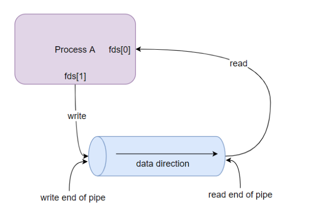

# Linux Embedded Programming: General Knowledge

This directory contains examples and demonstrations of fundamental concepts in C programming and Linux embedded development. These examples serve as educational resources for understanding key concepts like compilation stages, libraries, and inter-process communication.

## Contents

### 1. Four Stages of C Compilation

**Directory:** [4-stage-compiling-C](./4-stage-compiling-C)

This example demonstrates the four stages of C compilation:

1. **Pre-processing**: Expands macros and includes header files
2. **Compilation**: Converts C code to assembly language
3. **Assembly**: Converts assembly code to object code
4. **Linking**: Combines object files and libraries into an executable

**Usage:**
```bash
cd 4-stage-compiling-C
# To see each stage individually:
make stage1  # Pre-processing (creates hello.i)
make stage2  # Compilation (creates hello.S)
make stage3  # Assembly (creates hello.o)
make stage4  # Linking (creates hello executable)
# Or build the complete executable:
make all
# Clean up:
make clean
```

### 2. Static and Shared Libraries

**Directory:** [static-N-shared-lib](./static-N-shared-lib)

This example demonstrates how to create and use shared libraries in C. It includes:

- Creating object files from source code
- Building a shared library
- Installing the library
- Linking an executable with the shared library

**Directory Structure:**
- `bin/`: Directory for the executable file
- `obj/`: Directory for the object files
- `inc/`: Directory for the header files
- `src/`: Directory for the C source files
- `lib/`: Directory for the static and shared libraries

**Usage:**
```bash
cd static-N-shared-lib
# Build everything:
make all
# Clean up:
make clean
```

**Note:** The `-lhello` flag in the Makefile is equivalent to `-l$(PRJ_NAME)` which links to the library in `$(BIN_DIR)/$(PRJ_NAME)`.

### 3. Inter-Process Communication: Pipes

**File:** [pipe_read_write.png](./pipe_read_write.png)



This diagram illustrates the concept of pipes for inter-process communication (IPC) in Linux. Pipes provide a powerful mechanism for related processes to exchange data in a unidirectional flow.

#### How Pipes Work (as shown in the diagram):

1. **Pipe Creation**: A pipe is created using the `pipe()` system call, which returns two file descriptors:
   - `fd[0]`: The read end of the pipe
   - `fd[1]`: The write end of the pipe

2. **Process Forking**: After creating a pipe, a process typically calls `fork()` to create a child process. Both parent and child inherit copies of both file descriptors.

3. **Communication Setup**:
   - For parent-to-child communication: The parent closes `fd[0]` (read end) and the child closes `fd[1]` (write end)
   - For child-to-parent communication: The child closes `fd[0]` and the parent closes `fd[1]`

4. **Data Transfer**:
   - The writing process uses `write(fd[1], data, size)` to send data
   - The reading process uses `read(fd[0], buffer, size)` to receive data

5. **Pipe Closure**: When finished, processes close their remaining file descriptors

#### Key Characteristics of Pipes:

- **Unidirectional**: Data flows in only one direction (for bidirectional communication, two pipes are needed)
- **FIFO Behavior**: First data written is the first data read (First In, First Out)
- **Buffer Size**: Pipes have a limited buffer size (typically 65,536 bytes in modern Linux)
- **Blocking Operations**: Reads block when the pipe is empty; writes block when the pipe is full
- **Atomic Writes**: Small writes (< PIPE_BUF, typically 4KB) are guaranteed to be atomic

#### Example Code:

Here's a simple example demonstrating pipe usage for parent-child communication:

```c
#include <stdio.h>
#include <stdlib.h>
#include <unistd.h>
#include <string.h>

#define BUFFER_SIZE 100

int main() {
    int fd[2];  // File descriptors for the pipe
    pid_t pid;   // Process ID
    char buffer[BUFFER_SIZE];

    // Create the pipe
    if (pipe(fd) == -1) {
        perror("pipe");
        exit(EXIT_FAILURE);
    }

    // Create a child process
    pid = fork();

    if (pid < 0) {
        // Fork failed
        perror("fork");
        exit(EXIT_FAILURE);
    }

    if (pid > 0) {
        // Parent process
        // Close the read end of the pipe
        close(fd[0]);

        // Write a message to the pipe
        const char *message = "Hello from parent!";
        write(fd[1], message, strlen(message) + 1);
        printf("Parent sent: %s\n", message);

        // Close the write end of the pipe
        close(fd[1]);

        // Wait for the child to terminate
        wait(NULL);
    } else {
        // Child process
        // Close the write end of the pipe
        close(fd[1]);

        // Read the message from the pipe
        read(fd[0], buffer, BUFFER_SIZE);
        printf("Child received: %s\n", buffer);

        // Close the read end of the pipe
        close(fd[0]);
    }

    return 0;
}
```

This example demonstrates:
- Creating a pipe with `pipe()`
- Forking a child process with `fork()`
- Properly closing unused pipe ends
- Writing data from the parent to the child
- Reading data in the child process

## Learning Objectives

These examples are designed to help you understand:

1. How C code is transformed into an executable through the compilation process
2. How to create and use shared libraries in Linux
3. Inter-process communication using pipes, including:
   - How to create and use pipes for communication between related processes
   - The unidirectional nature of pipes and how to handle data flow
   - Best practices for managing file descriptors in parent and child processes
   - How to implement simple IPC mechanisms in your own applications

## Prerequisites

To work with these examples, you'll need:

- A Linux environment (Ubuntu recommended)
- GCC compiler
- Make utility

## Building and Running

Each subdirectory contains its own Makefile with specific instructions. Generally, you can:

1. Navigate to the example directory
2. Run `make all` to build the example
3. Run the resulting executable
4. Use `make clean` to remove generated files

## Additional Resources

For more information on these topics, consider the following resources:

- [GCC Documentation](https://gcc.gnu.org/onlinedocs/)
- [GNU Make Manual](https://www.gnu.org/software/make/manual/make.html)
- [Linux Shared Libraries Tutorial](https://tldp.org/HOWTO/Program-Library-HOWTO/shared-libraries.html)
- [Linux Inter-Process Communication](https://tldp.org/LDP/tlk/ipc/ipc.html)
- [Pipe System Call in Linux](https://man7.org/linux/man-pages/man2/pipe.2.html)

## Practical Applications of Pipes

Pipes are widely used in Linux and embedded systems for various purposes:

1. **Shell Command Pipelines**: The `|` operator in shell commands creates pipes between processes
   ```bash
   ls -l | grep "txt" | wc -l  # Count text files in directory
   ```

2. **Parent-Child Communication**: Used when a process creates a child and needs to exchange data
   - Log collection from child processes
   - Sending configuration data to children
   - Gathering results from parallel workers

3. **Sensor Data Processing**: In embedded systems, pipes can connect sensor reading processes with data processing and storage processes

4. **Filter Chains**: Creating a series of processes that each perform one transformation on data

5. **Implementing Command Patterns**: Using pipes to send commands from a controller process to worker processes

Pipes are particularly valuable in embedded Linux systems where their simplicity, reliability, and low overhead make them ideal for inter-process communication.
