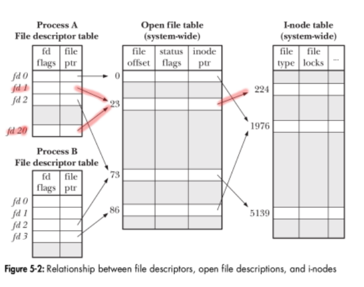
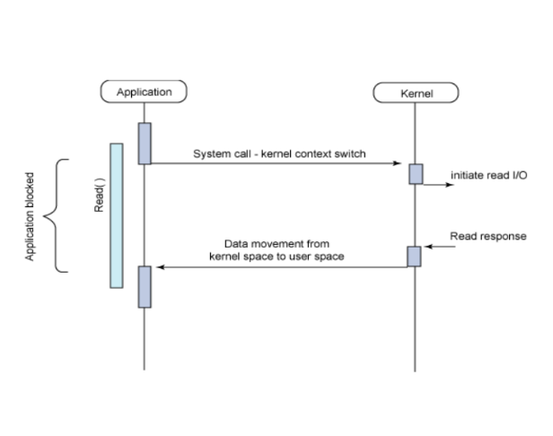
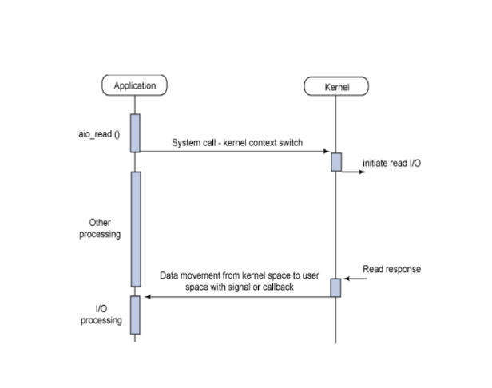
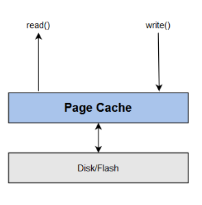

# Linux File System Concepts and Examples

This directory contains examples and illustrations demonstrating key concepts of the Linux file system, file descriptors, and file I/O operations. Understanding these concepts is essential for effective Linux and embedded systems programming.

## File System Architecture



The Linux file system is organized as a hierarchical tree structure, with the root directory (`/`) at the top. Key aspects of the Linux file system include:

1. **Everything is a file**: Regular files, directories, devices, sockets, and pipes are all represented as files
2. **Unified namespace**: All storage devices are mounted into a single directory tree
3. **Virtual File System (VFS)**: Provides a common interface for different file system types
4. **Inodes**: Store metadata about files (permissions, timestamps, ownership, etc.)
5. **File descriptors**: Integer handles that reference open files

## File Descriptors and I/O Operations



File descriptors are small non-negative integers that the kernel uses to identify the files being accessed by a process. When a process opens a file, the kernel returns a file descriptor that the process uses for subsequent operations on that file.

### Standard File Descriptors:
- **0**: Standard input (stdin)
- **1**: Standard output (stdout)
- **2**: Standard error (stderr)

### Key File Operations:
- **open()**: Opens a file and returns a file descriptor
- **read()**: Reads data from a file
- **write()**: Writes data to a file
- **lseek()**: Changes the file offset
- **close()**: Closes a file descriptor

## File System Implementation



The Linux file system implementation involves several layers:

1. **User Space**: Applications make system calls to interact with files
2. **VFS Layer**: Provides a common interface for all file systems
3. **File System Specific Layer**: Implements specific file system types (ext4, XFS, etc.)
4. **Block I/O Layer**: Manages block devices and caching
5. **Device Drivers**: Communicate with physical storage devices

## Data Structures



The kernel uses several data structures to manage files:

1. **Inode**: Contains metadata about a file (permissions, size, timestamps)
2. **Dentry**: Maps filenames to inodes
3. **File**: Represents an open file within a process
4. **File Descriptor Table**: Per-process table of open file descriptors
5. **File Table**: System-wide table of open files
6. **Inode Table**: System-wide table of active inodes

## Examples

### Example 1: File Append Behavior

**Directory:** [ex-01](./ex-01)

This example demonstrates how the `O_APPEND` flag affects file operations:

```c
// Open file with O_APPEND
fd = open(filename, O_WRONLY | O_APPEND);

// Seek to the beginning of the file
lseek(fd, 0, SEEK_SET);

// Write data - will still be appended to the end
write(fd, data, strlen(data));
```

**Key Concept:** When a file is opened with `O_APPEND`, all writes are forced to append to the end of the file, regardless of the current file offset. This behavior is atomic and thread-safe.

### Example 2: Multiple File Descriptors

**Directory:** [ex-02](./ex-02)

This example shows how multiple file descriptors can reference the same file and how operations on one descriptor affect the others:

```c
// Open file with three different file descriptors
fd1 = open(filename, O_RDWR | O_CREAT | O_TRUNC, 0666);
fd2 = open(filename, O_RDWR);
fd3 = open(filename, O_RDWR);

// Operations on these descriptors affect the same file
write(fd1, "Hello,", 6);
write(fd2, "world", 6);
lseek(fd2, 0, SEEK_SET);
write(fd1, "HELLO,", 6);
write(fd3, "Gidday", 6);
```

**Key Concept:** Multiple file descriptors can reference the same file. Each descriptor maintains its own file offset, but they all access the same underlying file data. This allows for complex file manipulation patterns.

### Example 3: High-Level File I/O

**Directory:** [ex-03](./ex-03)

This example demonstrates the use of high-level file I/O functions from the C standard library:

```c
// Reading a file
FILE *file = fopen(filename, "r");
fread(buffer, 1, num_bytes, file);
fclose(file);

// Writing to a file
FILE *file = fopen(filename, "w");
fprintf(file, "%s", text);
fclose(file);
```

**Key Concept:** The C standard library provides buffered I/O functions that are built on top of the lower-level system calls. These functions are often more convenient but may have different performance characteristics.

## File Access Modes and Flags

When opening files, various flags can be used to control the behavior:

| Flag | Description |
|------|-------------|
| `O_RDONLY` | Open for reading only |
| `O_WRONLY` | Open for writing only |
| `O_RDWR` | Open for reading and writing |
| `O_APPEND` | Append to the end of file on each write |
| `O_CREAT` | Create the file if it doesn't exist |
| `O_TRUNC` | Truncate the file to zero length |
| `O_EXCL` | With O_CREAT, fail if file already exists |
| `O_NONBLOCK` | Open in non-blocking mode |

## File Seeking

The `lseek()` function changes the file offset for subsequent read/write operations:

```c
lseek(fd, offset, whence);
```

Where `whence` can be:
- `SEEK_SET`: Offset is relative to the start of the file
- `SEEK_CUR`: Offset is relative to the current position
- `SEEK_END`: Offset is relative to the end of the file

## Best Practices

1. **Always check return values** from file operations for error conditions
2. **Close file descriptors** when they are no longer needed
3. **Use appropriate flags** when opening files
4. **Be aware of buffering** when using high-level I/O functions
5. **Consider thread safety** when multiple threads access the same file
6. **Use file locking** when multiple processes access the same file concurrently

## Additional Resources

- [Linux Filesystem Hierarchy Standard](https://refspecs.linuxfoundation.org/FHS_3.0/fhs-3.0.html)
- [The Linux Programming Interface](http://man7.org/tlpi/) by Michael Kerrisk
- [Linux man pages - section 2 (System Calls)](https://man7.org/linux/man-pages/dir_section_2.html)
- [Linux man pages - section 3 (Library Functions)](https://man7.org/linux/man-pages/dir_section_3.html)
