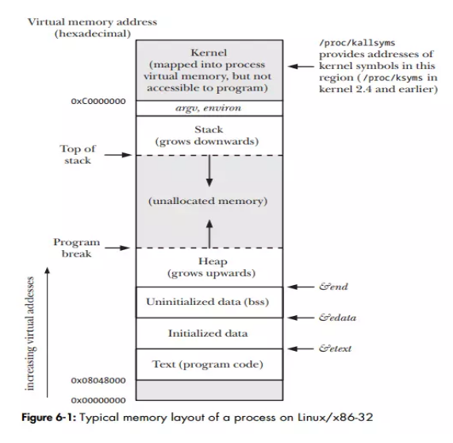
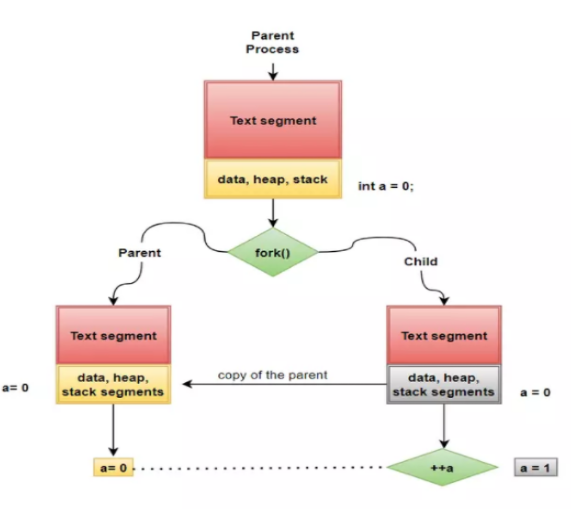
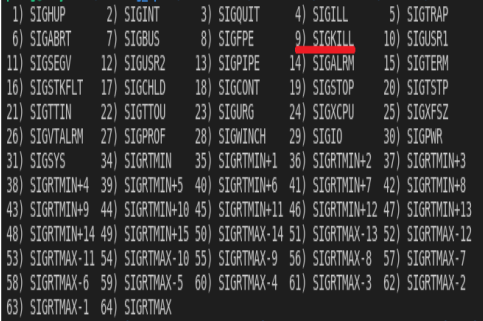

# Linux Process Management

This directory contains examples and illustrations demonstrating key concepts of Linux process management, including process creation, termination, inter-process communication, and process states. Understanding these concepts is essential for effective Linux and embedded systems programming.

## Process Fundamentals



A process is an instance of a program in execution. Each process in Linux has:

1. **Process ID (PID)**: A unique identifier for the process
2. **Parent Process ID (PPID)**: The PID of the process that created it
3. **Memory Space**: Including text (code), data, heap, and stack segments
4. **File Descriptors**: References to open files and I/O channels
5. **Environment Variables**: Key-value pairs inherited from the parent process
6. **Security Context**: User ID, group ID, and permissions

## Process Creation and Lifecycle



In Linux, processes follow a specific lifecycle:

1. **Creation**: A new process is created using `fork()` or similar system calls
2. **Execution**: The process runs its code, potentially creating child processes
3. **Termination**: The process exits, either voluntarily or due to signals
4. **Zombie State**: After termination, a process becomes a zombie until its parent collects its exit status
5. **Cleanup**: The parent process collects the exit status using `wait()` or `waitpid()`

### Key Process States:
- **Running**: The process is executing on a CPU
- **Ready**: The process is ready to execute but waiting for CPU time
- **Blocked**: The process is waiting for some event (I/O, signal, etc.)
- **Zombie**: The process has terminated but its exit status hasn't been collected
- **Stopped**: The process has been stopped (e.g., by a signal)

## Process Relationships and Communication



Processes in Linux form a hierarchical tree structure:

1. **Parent-Child Relationship**: Each process (except the initial process) has a parent
2. **Orphan Processes**: Processes whose parent has terminated
3. **Zombie Processes**: Terminated processes whose exit status hasn't been collected
4. **Process Groups**: Collections of related processes
5. **Sessions**: Groups of process groups, typically associated with a terminal

## Examples

### Example 1: Basic Process Creation with fork()

**Directory:** [ex-01](./ex-01)

This example demonstrates the basic use of `fork()` to create a child process:

```c
pid_t child_pid = fork();
if (child_pid >= 0) {
    if (0 == child_pid) {
        // Child process code
        printf("I am the child process, counter: %d\n", ++counter);
        printf("My PID is: %d, my parent PID is: %d", getpid(), getppid());
    } else {
        // Parent process code
        printf("I am the parent process, counter: %d\n", ++counter);
        printf("My PID is: %d\n", getpid());
    }
}
```

**Key Concepts:**
- `fork()` creates a new process by duplicating the calling process
- The child process is an exact copy of the parent, except for the return value of `fork()`
- In the parent, `fork()` returns the PID of the child
- In the child, `fork()` returns 0
- Variables are copied, not shared, between parent and child

### Example 2: Process Replacement with exec()

**Directory:** [ex-02](./ex-02)

This example shows how to replace a process's image using the `exec()` family of functions:

```c
if (pid == 0) {
    // Child process
    char *env_var = getenv("EXEC_CMD");
    if (strcmp(env_var, "1") == 0) {
        execlp("ls", "ls", NULL);
    } else if (strcmp(env_var, "2") == 0) {
        execlp("date", "date", NULL);
    }
    // If exec() succeeds, this code is never reached
    perror("exec failed");
    exit(1);
} else {
    // Parent process
    wait(NULL);
    printf("Child process finished.\n");
}
```

**Key Concepts:**
- `exec()` functions replace the current process image with a new one
- The process ID remains the same
- Environment variables can be used to control behavior
- `wait()` allows a parent to wait for a child to terminate

### Example 3: Process Signaling

**Directory:** [ex-03](./ex-03)

This example demonstrates inter-process communication using signals:

```c
// Signal handler function
void handle_signal(int signum) {
    printf("Child process %d received signal %d\n", getpid(), signum);
}

// In main()
if (child_pid == 0) {
    // Child process
    signal(SIGUSR1, handle_signal);
    printf("Child process %d waiting for signal...\n", getpid());
    pause();  // Wait for a signal
} else {
    // Parent process
    sleep(1);
    kill(child_pid, SIGUSR1);  // Send signal to child
    printf("Parent process exiting.\n");
}
```

**Key Concepts:**
- Signals are software interrupts sent to a process
- The `signal()` function sets up a handler for a specific signal
- `kill()` sends a signal to a process
- Signals can be used for simple inter-process communication

### Example 4: Process Termination and Status Collection

**Directory:** [ex-04](./ex-04)

This example shows how a parent process can collect the exit status of a child:

```c
if (child_pid == 0) {
    // Child process
    printf("Child process (PID: %d) exiting with status: 42\n", getpid());
    exit(42);
} else {
    // Parent process
    printf("Parent process (PID: %d) waiting for child (PID: %d)\n", getpid(), child_pid);
    wait(&status);
    if (WIFEXITED(status)) {
        printf("Child exited normally with status: %d\n", WEXITSTATUS(status));
    } else {
        printf("Child did not exit normally\n");
    }
}
```

**Key Concepts:**
- `exit()` terminates a process with a specified status code
- `wait()` suspends the calling process until a child terminates
- `WIFEXITED()` and `WEXITSTATUS()` macros extract information from the status value
- Proper status collection prevents zombie processes

### Example 5: Zombie and Orphan Processes

**Directory:** [ex-05](./ex-05)

This example demonstrates zombie and orphan processes:

#### Zombie Process:
```c
if (pid == 0) {
    // Child process exits immediately
    printf("Child process (PID: %d) exiting to become a zombie\n", getpid());
    exit(0);
} else {
    // Parent process sleeps without calling wait()
    printf("Parent process (PID: %d) created a child (PID: %d) and is now sleeping.\n", getpid(), pid);
    sleep(10);  // Child becomes a zombie during this time
}
```

#### Orphan Process:
```c
if (pid == 0) {
    // Child sleeps to ensure the parent exits first
    sleep(5);
    printf("Orphan process (PID: %d) now has parent PID: %d\n", getpid(), getppid());
    sleep(10);  // Keep running for observation
} else {
    // Parent exits early
    printf("Parent process (PID: %d) exiting early, child (PID: %d) will become an orphan.\n", getpid(), pid);
    exit(0);
}
```

**Key Concepts:**
- **Zombie Process**: A process that has terminated but whose exit status hasn't been collected by its parent
- **Orphan Process**: A process whose parent has terminated; it's adopted by the init process (PID 1)
- Zombies consume minimal resources but should be avoided in long-running applications
- Orphans continue execution normally under the init process

## Process Management System Calls

| System Call | Description |
|-------------|-------------|
| `fork()` | Creates a new process by duplicating the calling process |
| `exec()` family | Replaces the current process image with a new one |
| `exit()` | Terminates the calling process |
| `wait()` | Waits for a child process to terminate |
| `waitpid()` | Waits for a specific child process to terminate |
| `getpid()` | Returns the process ID of the calling process |
| `getppid()` | Returns the parent process ID of the calling process |
| `kill()` | Sends a signal to a process |
| `signal()` | Sets a function to handle a specific signal |

## Process-Related Files in /proc

The `/proc` filesystem provides information about processes:

- `/proc/[pid]/cmdline`: Command line arguments
- `/proc/[pid]/environ`: Environment variables
- `/proc/[pid]/exe`: Symbolic link to the executable
- `/proc/[pid]/fd/`: Directory containing file descriptors
- `/proc/[pid]/maps`: Memory mappings
- `/proc/[pid]/status`: Process status information

## Best Practices

1. **Always check return values** from process-related system calls
2. **Collect exit status** of child processes to prevent zombies
3. **Handle signals appropriately** to ensure proper process behavior
4. **Use proper synchronization** when multiple processes access shared resources
5. **Consider resource limits** when creating multiple processes
6. **Avoid creating orphans** in long-running applications

## Additional Resources

- [Linux man pages - section 2 (System Calls)](https://man7.org/linux/man-pages/dir_section_2.html)
- [The Linux Programming Interface](http://man7.org/tlpi/) by Michael Kerrisk
- [Advanced Programming in the UNIX Environment](https://www.amazon.com/Advanced-Programming-UNIX-Environment-3rd/dp/0321637739) by W. Richard Stevens and Stephen A. Rago
- [Understanding the Linux Kernel](https://www.oreilly.com/library/view/understanding-the-linux/0596005652/) by Daniel P. Bovet and Marco Cesati
