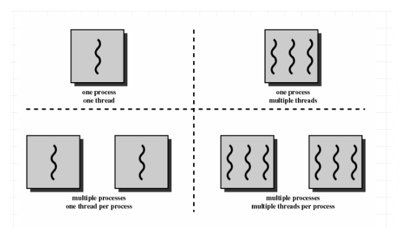
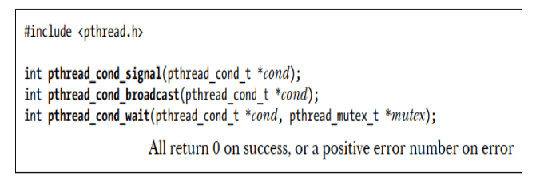

# Linux Thread Programming

This directory contains examples and illustrations demonstrating key concepts of Linux thread programming using the POSIX threads (pthreads) library. Understanding these concepts is essential for developing efficient concurrent applications in Linux and embedded systems.

## Thread Fundamentals



Threads are lightweight execution units that share the same memory space within a process. Key characteristics of threads include:

1. **Shared Memory Space**: All threads within a process share the same memory space, including global variables, heap, and file descriptors
2. **Independent Execution**: Each thread has its own stack and program counter
3. **Lightweight**: Creating and switching between threads is faster than creating and switching between processes
4. **Concurrent Execution**: Threads can execute concurrently, potentially on different CPU cores

### Threads vs. Processes

| Feature | Threads | Processes |
|---------|---------|-----------|
| Memory Space | Shared | Separate |
| Creation Overhead | Low | High |
| Context Switch | Fast | Slow |
| Communication | Direct (shared memory) | IPC mechanisms |
| Isolation | Low | High |
| Failure Impact | Can affect entire process | Limited to the process |

## Thread Synchronization



When multiple threads access shared resources, synchronization mechanisms are necessary to prevent race conditions and ensure data consistency:

1. **Mutexes**: Provide exclusive access to a shared resource
2. **Condition Variables**: Allow threads to wait for a specific condition to occur
3. **Read-Write Locks**: Allow multiple readers or a single writer
4. **Semaphores**: Control access to a limited number of resources
5. **Barriers**: Synchronize multiple threads at a specific point

## Examples

### Example 1: Basic Thread Creation and Joining

**Directory:** [ex-01](./ex-01)

This example demonstrates the basic creation and joining of threads:

```c
#define NUMBER_THREADS 2

void* print_message(void* arg) {
    int thread_id = *(int*)arg;
    printf("Thread %d: Hello from thread\n", thread_id);
}

int main() {
    pthread_t threads[NUMBER_THREADS];
    
    // Create threads
    for (int i = 0; i < NUMBER_THREADS; i++) {
        int* thread_id = malloc(sizeof(int));
        *thread_id = i + 1;
        pthread_create(&threads[i], NULL, print_message, thread_id);
    }
    
    // Wait for threads to finish
    for (int i = 0; i < NUMBER_THREADS; i++) {
        pthread_join(threads[i], NULL);
    }
    
    printf("All threads completed!\n");
}
```

**Key Concepts:**
- `pthread_create()` creates a new thread that executes the specified function
- `pthread_join()` waits for a thread to terminate
- Thread functions receive and return a void pointer, allowing for flexible data passing
- Each thread has its own execution context

### Example 2: Mutex for Thread Synchronization

**Directory:** [ex-02](./ex-02)

This example demonstrates using a mutex to protect a shared counter:

```c
#define NUM_THREADS 3
#define INCREMENTS_PER_THREAD 1000000

int counter = 0;  // Shared global counter
pthread_mutex_t mutex = PTHREAD_MUTEX_INITIALIZER;

void* increment_counter(void* arg) {
    for (int i = 0; i < INCREMENTS_PER_THREAD; i++) {
        pthread_mutex_lock(&mutex);
        counter++;
        pthread_mutex_unlock(&mutex);
    }
    return NULL;
}

int main() {
    pthread_t threads[NUM_THREADS];
    
    // Create threads
    for (int i = 0; i < NUM_THREADS; i++) {
        pthread_create(&threads[i], NULL, increment_counter, NULL);
    }
    
    // Wait for threads to finish
    for (int i = 0; i < NUM_THREADS; i++) {
        pthread_join(threads[i], NULL);
    }
    
    pthread_mutex_destroy(&mutex);
    printf("Final counter value: %d\n", counter);
    return 0;
}
```

**Key Concepts:**
- Mutexes provide exclusive access to shared resources
- `pthread_mutex_lock()` acquires the mutex, blocking if it's already locked
- `pthread_mutex_unlock()` releases the mutex
- Without synchronization, the counter would likely be less than expected due to race conditions
- `pthread_mutex_destroy()` cleans up the mutex when it's no longer needed

### Example 3: Producer-Consumer with Condition Variables

**Directory:** [ex-03](./ex-03)

This example demonstrates a producer-consumer pattern using condition variables:

```c
int data = 0;  // Shared global variable
int data_ready = 0;  // Flag to indicate data availability

pthread_mutex_t mutex = PTHREAD_MUTEX_INITIALIZER;
pthread_cond_t cond = PTHREAD_COND_INITIALIZER;

void* producer(void* arg) {
    for (int i = 1; i <= NUM_ITERATIONS; i++) {
        // Generate random number
        int random_number = rand() % 10 + 1;
        
        pthread_mutex_lock(&mutex);
        data = random_number;
        data_ready = 1;
        printf("Producer: generated %d\n", data);
        pthread_cond_signal(&cond);
        pthread_mutex_unlock(&mutex);
        sleep(1);
    }
    return NULL;
}

void* consumer(void* arg) {
    for (int i = 1; i <= NUM_ITERATIONS; i++) {
        pthread_mutex_lock(&mutex);
        while (!data_ready) {
            pthread_cond_wait(&cond, &mutex);
        }
        printf("Consumer: Read %d\n", data);
        data_ready = 0;  // Reset flag
        pthread_mutex_unlock(&mutex);
    }
    return NULL;
}
```

**Key Concepts:**
- Condition variables allow threads to wait for a specific condition
- `pthread_cond_wait()` atomically releases the mutex and blocks the thread until signaled
- `pthread_cond_signal()` wakes up one thread waiting on the condition
- The producer-consumer pattern is a common concurrency pattern for data processing
- The mutex protects the shared data and the condition flag

### Example 4: Parallel Computation

**Directory:** [ex-04](./ex-04)

This example demonstrates parallel computation by using threads to count even and odd numbers:

```c
#define SIZE 100
int numbers[SIZE];
int even_count = 0;
int odd_count = 0;

void* count_even(void* arg) {
    for (int i = 0; i < SIZE; i++) {
        if (numbers[i] % 2 == 0) {
            even_count += numbers[i];
        }
    }
    pthread_exit(NULL);
}

void* count_odd(void* arg) {
    for (int i = 0; i < SIZE; i++) {
        if (numbers[i] % 2 == 1) {
            odd_count += numbers[i];
        }
    }
    pthread_exit(NULL);
}

int main() {
    pthread_t even_thread, odd_thread;
    
    // Generate random numbers
    srand(time(NULL));
    for (int i = 0; i < SIZE; i++) {
        numbers[i] = rand() % 100 + 1;
    }
    
    // Create threads
    pthread_create(&even_thread, NULL, count_even, NULL);
    pthread_create(&odd_thread, NULL, count_odd, NULL);
    
    // Wait for threads to finish
    pthread_join(even_thread, NULL);
    pthread_join(odd_thread, NULL);
    
    printf("Total even numbers: %d\n", even_count);
    printf("Total odd numbers: %d\n", odd_count);
    return 0;
}
```

**Key Concepts:**
- Threads can be used to parallelize computation
- Each thread performs a specific task on the shared data
- `pthread_exit()` explicitly terminates a thread
- This example has a race condition since both threads update global variables without synchronization
- In real applications, proper synchronization would be needed for the shared counters

### Example 5: Read-Write Locks

**Directory:** [ex-05](./ex-05)

This example demonstrates read-write locks, which allow multiple readers or a single writer:

```c
#define NUM_READERS 5
#define NUM_WRITERS 2

int data = 0;
pthread_rwlock_t rwlock;

void* reader(void* arg) {
    int id = *(int*)arg;
    pthread_rwlock_rdlock(&rwlock);
    printf("Reader %d: Data = %d\n", id, data);
    pthread_rwlock_unlock(&rwlock);
    return NULL;
}

void* writer(void* arg) {
    int id = *(int*)arg;
    pthread_rwlock_wrlock(&rwlock);
    data++;
    printf("Writer %d: Incremented Data to %d\n", id, data);
    pthread_rwlock_unlock(&rwlock);
    return NULL;
}

int main() {
    pthread_t readers[NUM_READERS], writers[NUM_WRITERS];
    int reader_ids[NUM_READERS], writer_ids[NUM_WRITERS];
    
    pthread_rwlock_init(&rwlock, NULL);
    
    // Create reader and writer threads
    for (int i = 0; i < NUM_READERS; i++) {
        reader_ids[i] = i + 1;
        pthread_create(&readers[i], NULL, reader, &reader_ids[i]);
    }
    
    for (int i = 0; i < NUM_WRITERS; i++) {
        writer_ids[i] = i + 1;
        pthread_create(&writers[i], NULL, writer, &writer_ids[i]);
    }
    
    // Wait for all threads to finish
    for (int i = 0; i < NUM_READERS; i++) {
        pthread_join(readers[i], NULL);
    }
    
    for (int i = 0; i < NUM_WRITERS; i++) {
        pthread_join(writers[i], NULL);
    }
    
    pthread_rwlock_destroy(&rwlock);
    printf("Final Data Value: %d\n", data);
    return 0;
}
```

**Key Concepts:**
- Read-write locks allow multiple readers or a single writer
- `pthread_rwlock_rdlock()` acquires a read lock, which can be held by multiple threads simultaneously
- `pthread_rwlock_wrlock()` acquires a write lock, which is exclusive
- Read-write locks are useful when reads are more frequent than writes
- `pthread_rwlock_init()` and `pthread_rwlock_destroy()` initialize and clean up the lock

## Thread Attributes and Configuration

POSIX threads can be configured with various attributes:

- **Stack Size**: Control the size of the thread's stack
- **Detach State**: Determine whether a thread can be joined
- **Scheduling Policy**: Set the thread's scheduling policy
- **Priority**: Set the thread's priority
- **Inheritance**: Control attribute inheritance

Example of setting thread attributes:

```c
pthread_attr_t attr;
pthread_attr_init(&attr);
pthread_attr_setstacksize(&attr, 1024 * 1024);  // 1MB stack
pthread_attr_setdetachstate(&attr, PTHREAD_CREATE_DETACHED);
pthread_create(&thread, &attr, thread_function, arg);
pthread_attr_destroy(&attr);
```

## Thread Safety Considerations

When developing multithreaded applications, consider these thread safety issues:

1. **Race Conditions**: Occur when multiple threads access shared data concurrently
2. **Deadlocks**: Occur when threads wait for each other in a circular dependency
3. **Priority Inversion**: Occurs when a high-priority thread waits for a low-priority thread
4. **Thread-Local Storage**: Use when each thread needs its own copy of a variable
5. **Reentrant Functions**: Ensure functions can be safely called by multiple threads

## Best Practices

1. **Minimize Shared Data**: Reduce the need for synchronization
2. **Use Appropriate Synchronization**: Choose the right mechanism for the task
3. **Avoid Nested Locks**: Minimize the risk of deadlocks
4. **Keep Critical Sections Short**: Minimize the time locks are held
5. **Consider Thread Pools**: Reuse threads to reduce creation overhead
6. **Be Aware of Thread Safety**: Use thread-safe functions or provide synchronization
7. **Clean Up Resources**: Destroy mutexes, condition variables, and other resources when done

## Additional Resources

- [POSIX Threads Programming Guide](https://computing.llnl.gov/tutorials/pthreads/)
- [Linux man pages - pthread](https://man7.org/linux/man-pages/man7/pthreads.7.html)
- [The Linux Programming Interface](http://man7.org/tlpi/) by Michael Kerrisk
- [Programming with POSIX Threads](https://www.amazon.com/Programming-POSIX-Threads-David-Butenhof/dp/0201633922) by David R. Butenhof
