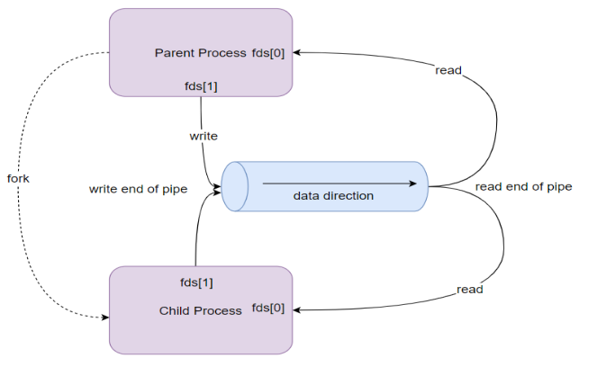
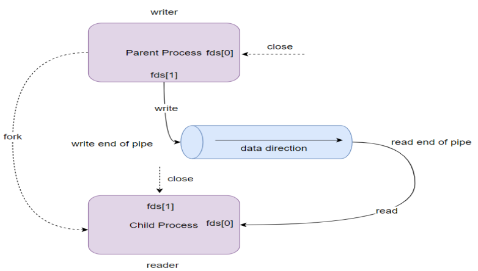
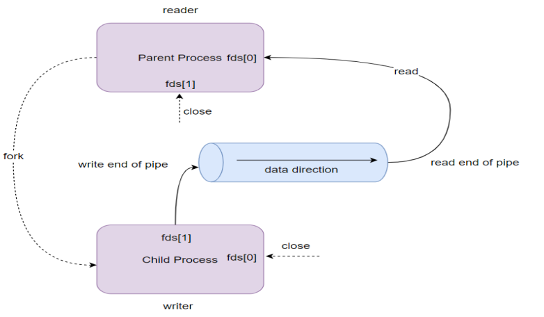

# Linux Pipes and FIFOs

This directory contains examples and illustrations demonstrating key concepts of inter-process communication (IPC) in Linux using pipes and FIFOs (named pipes). Understanding these mechanisms is essential for developing efficient communication between processes in Linux and embedded systems.

## Pipes and FIFOs Overview



Pipes and FIFOs are fundamental IPC mechanisms in Linux that allow data to flow from one process to another:

### Pipes
- **Unnamed pipes**: Created using the `pipe()` system call
- **Unidirectional**: Data flows in one direction only
- **Related processes only**: Typically used between parent and child processes
- **Temporary**: Exist only as long as the processes using them

### FIFOs (Named Pipes)
- **Named pipes**: Created using the `mkfifo()` system call or `mkfifo` command
- **Persistent**: Exist as special files in the filesystem
- **Unrelated processes**: Can be used between unrelated processes
- **Unidirectional**: Like pipes, data flows in one direction only

## Process vs. Thread Communication



Understanding the differences between process and thread communication is crucial for designing efficient systems:

### Process Communication
- **Separate memory spaces**: Processes have isolated memory
- **Explicit IPC mechanisms needed**: Pipes, FIFOs, sockets, shared memory, etc.
- **Higher overhead**: Context switching between processes is expensive
- **Better isolation**: Failures in one process don't directly affect others
- **Security**: Better protection between processes

### Thread Communication
- **Shared memory space**: Threads within a process share memory
- **Direct communication**: Can use shared variables and data structures
- **Lower overhead**: Context switching between threads is faster
- **Less isolation**: Bugs in one thread can affect the entire process
- **Synchronization required**: Need mutexes, condition variables, etc.

## Request-Response Patterns



When implementing request-response patterns, different approaches can be used depending on the requirements:

### Using Processes with Pipes/FIFOs
- **Two pipes/FIFOs**: One for requests, one for responses
- **Bidirectional communication**: Each process reads from one pipe and writes to another
- **Process isolation**: Failures in one process don't affect others
- **Scalability**: Can distribute across multiple cores or even machines (with named pipes)

### Using Threads with Shared Memory
- **Shared data structures**: Request and response queues in shared memory
- **Synchronization**: Mutexes and condition variables to coordinate access
- **Lower overhead**: Faster communication within the same process
- **Simpler implementation**: No need for explicit IPC mechanisms

### Hybrid Approach
- **Worker processes**: Separate processes for isolation
- **Thread pools**: Multiple threads within each process for efficiency
- **IPC between processes**: Pipes/FIFOs for inter-process communication
- **Shared memory within processes**: For thread communication

## Examples

### Example 1: Basic Pipe Communication

**Directory:** [ex-01](./ex-01)

This example demonstrates basic pipe communication between a parent and child process:

```c
int fd[2];  // Pipe file descriptors
pipe(fd);   // Create pipe
pid = fork();

if (pid > 0) {  
    // Parent Process
    close(fd[0]);  // Close unused read end
    char message[] = "Hello from parent!";
    write(fd[1], message, strlen(message) + 1);
    close(fd[1]);  // Close write end
} else {  
    // Child Process
    close(fd[1]);  // Close unused write end
    char buffer[BUFFER_SIZE];
    read(fd[0], buffer, BUFFER_SIZE);
    printf("Child received: %s\n", buffer);
    close(fd[0]);  // Close read end
}
```

**Key Concepts:**
- A pipe is created before forking to establish communication
- The parent writes to the pipe, and the child reads from it
- Unused pipe ends are closed to prevent resource leaks
- Data flows in one direction: from parent to child

### Example 2: Multi-Pipe Communication Chain

**Directory:** [ex-02](./ex-02)

This example demonstrates a chain of processes communicating through multiple pipes:

```c
// Create two pipes
pipe(pipe1);
pipe(pipe2);

// First fork - Create child 1
pid1 = fork();
if (pid1 == 0) {  
    // Child Process 1
    close(pipe1[1]);  // Close write end of pipe1
    close(pipe2[0]);  // Close read end of pipe2
    
    char buffer[BUFFER_SIZE];
    read(pipe1[0], buffer, BUFFER_SIZE);  // Read from parent
    close(pipe1[0]);
    
    // Modify the message
    strcat(buffer, " -> Modified by Child 1");
    
    write(pipe2[1], buffer, strlen(buffer) + 1);  // Send to Child 2
    close(pipe2[1]);
    exit(0);
}

// Second fork - Create child 2
pid2 = fork();
if (pid2 == 0) {  
    // Child Process 2
    close(pipe2[1]);  // Close write end of pipe2
    
    char buffer[BUFFER_SIZE];
    read(pipe2[0], buffer, BUFFER_SIZE);  // Read from Child 1
    close(pipe2[0]);
    
    printf("Child 2 received: %s\n", buffer);
    exit(0);
}

// Parent Process
close(pipe1[0]);
close(pipe2[0]);
close(pipe2[1]);

char message[] = "Hello from Parent!";
write(pipe1[1], message, strlen(message) + 1);
close(pipe1[1]);
```

**Key Concepts:**
- Multiple pipes create a communication chain
- Each process has a specific role in the chain
- Data flows from parent → child 1 → child 2
- Proper pipe end management prevents deadlocks

### Example 3: Character Count via Pipe

**Directory:** [ex-03](./ex-03)

This example demonstrates sending data through a pipe and processing it in the child process:

```c
// Create pipe and fork
pipe(pipefd);
pid = fork();

if (pid == 0) {  
    // Child process
    close(pipefd[1]);  // Close write end
    
    char buffer[BUFFER_SIZE];
    read(pipefd[0], buffer, BUFFER_SIZE);  // Read from pipe
    close(pipefd[0]);
    
    // Process the data
    int char_count = strlen(buffer);
    printf("Child received: \"%s\"\n", buffer);
    printf("Character count: %d\n", char_count);
    
    exit(0);
} else {  
    // Parent process
    close(pipefd[0]);  // Close read end
    write(pipefd[1], message, strlen(message) + 1);  // Write message to pipe
    close(pipefd[1]);
}
```

**Key Concepts:**
- The child process performs computation on data received from the parent
- Simple request-response pattern: parent sends data, child processes it
- Demonstrates how pipes can be used for data processing pipelines

## Implementing Efficient Request-Response Systems

When designing systems that handle requests and responses, consider these approaches to avoid bottlenecks:

### 1. Multiple Pipes for Bidirectional Communication

```c
int request_pipe[2];   // Parent → Child
int response_pipe[2];  // Child → Parent

pipe(request_pipe);
pipe(response_pipe);
pid = fork();

if (pid == 0) {  // Child
    close(request_pipe[1]);   // Close write end of request pipe
    close(response_pipe[0]);  // Close read end of response pipe
    
    // Process requests and send responses
    while (1) {
        char request[BUFFER_SIZE];
        read(request_pipe[0], request, BUFFER_SIZE);
        
        // Process request
        char response[BUFFER_SIZE];
        sprintf(response, "Processed: %s", request);
        
        write(response_pipe[1], response, strlen(response) + 1);
    }
} else {  // Parent
    close(request_pipe[0]);   // Close read end of request pipe
    close(response_pipe[1]);  // Close write end of response pipe
    
    // Send requests and receive responses
    char request[] = "Request data";
    write(request_pipe[1], request, strlen(request) + 1);
    
    char response[BUFFER_SIZE];
    read(response_pipe[0], response, BUFFER_SIZE);
    printf("Response: %s\n", response);
}
```

### 2. Thread Pool with Work Queue

```c
// Shared work queue protected by mutex and condition variable
pthread_mutex_t queue_mutex = PTHREAD_MUTEX_INITIALIZER;
pthread_cond_t queue_cond = PTHREAD_COND_INITIALIZER;
queue_t work_queue;  // Queue of work items

// Worker thread function
void* worker_thread(void* arg) {
    while (1) {
        pthread_mutex_lock(&queue_mutex);
        while (queue_empty(&work_queue)) {
            pthread_cond_wait(&queue_cond, &queue_mutex);
        }
        
        work_item_t* item = queue_pop(&work_queue);
        pthread_mutex_unlock(&queue_mutex);
        
        // Process work item
        process_request(item);
        
        // Signal completion
        pthread_mutex_lock(&queue_mutex);
        queue_push(&response_queue, create_response(item));
        pthread_cond_signal(&response_cond);
        pthread_mutex_unlock(&queue_mutex);
    }
    return NULL;
}

// Create thread pool
for (int i = 0; i < NUM_THREADS; i++) {
    pthread_create(&threads[i], NULL, worker_thread, NULL);
}
```

### 3. FIFO-Based Client-Server Model

```c
// Server code
mkfifo("/tmp/request_fifo", 0666);
mkfifo("/tmp/response_fifo", 0666);

int request_fd = open("/tmp/request_fifo", O_RDONLY);
int response_fd = open("/tmp/response_fifo", O_WRONLY);

while (1) {
    char request[BUFFER_SIZE];
    read(request_fd, request, BUFFER_SIZE);
    
    // Process request
    char response[BUFFER_SIZE];
    sprintf(response, "Processed: %s", request);
    
    write(response_fd, response, strlen(response) + 1);
}

// Client code
int request_fd = open("/tmp/request_fifo", O_WRONLY);
int response_fd = open("/tmp/response_fifo", O_RDONLY);

char request[] = "Request data";
write(request_fd, request, strlen(request) + 1);

char response[BUFFER_SIZE];
read(response_fd, response, BUFFER_SIZE);
printf("Response: %s\n", response);
```

## Process vs. Thread: When to Use Each

### Use Processes When:
- **Isolation is critical**: Crashes in one component shouldn't affect others
- **Security boundaries** are needed between components
- **Different privileges** are required for different components
- **Distributing across multiple cores or machines** is a priority
- **Memory usage** is high and separate address spaces help manage it

### Use Threads When:
- **Performance is critical**: Thread creation and context switching is faster
- **Shared memory access** is frequent and necessary
- **Resource usage** needs to be minimized
- **Communication between components** is intensive
- **Implementing parallel algorithms** within a single logical unit

### Use a Hybrid Approach When:
- **Different components have different requirements** for isolation vs. performance
- **Some components are I/O-bound** while others are CPU-bound
- **Scaling across both cores and machines** is needed
- **Complex systems** with multiple layers of abstraction

## Best Practices for Pipes and FIFOs

1. **Close unused pipe ends**: Prevent resource leaks and unexpected behavior
2. **Check return values**: Always check for errors in pipe, read, and write operations
3. **Consider buffer sizes**: Be aware of PIPE_BUF and potential blocking
4. **Use non-blocking I/O** when appropriate: `O_NONBLOCK` flag can prevent deadlocks
5. **Implement proper error handling**: Detect and handle broken pipes
6. **Clean up FIFOs**: Remove named pipes when they're no longer needed
7. **Consider message boundaries**: Pipes are byte streams, so you may need to implement your own message framing

## Additional Resources

- [Linux man pages - pipe(2)](https://man7.org/linux/man-pages/man2/pipe.2.html)
- [Linux man pages - mkfifo(3)](https://man7.org/linux/man-pages/man3/mkfifo.3.html)
- [The Linux Programming Interface](http://man7.org/tlpi/) by Michael Kerrisk
- [Advanced Programming in the UNIX Environment](https://www.amazon.com/Advanced-Programming-UNIX-Environment-3rd/dp/0321637739) by W. Richard Stevens and Stephen A. Rago
