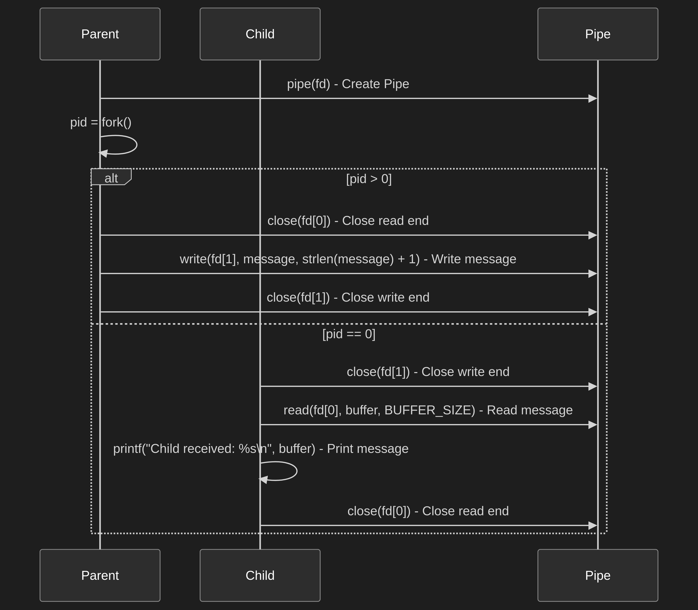

# Pipe Communication Between Parent and Child Process

## Description
This project demonstrates inter-process communication (IPC) using a pipe in C.
The parent process writes a message into the pipe, and the child process reads and prints it.

## Folder Structure

## Run 
compile:
```bash
make
```
### execute
```bash
./bin/pipe_program
```

## Youtube Demo
[Click here ](hhttps://youtu.be/H-HjzywRRSw)


## Mermaid graph structure

