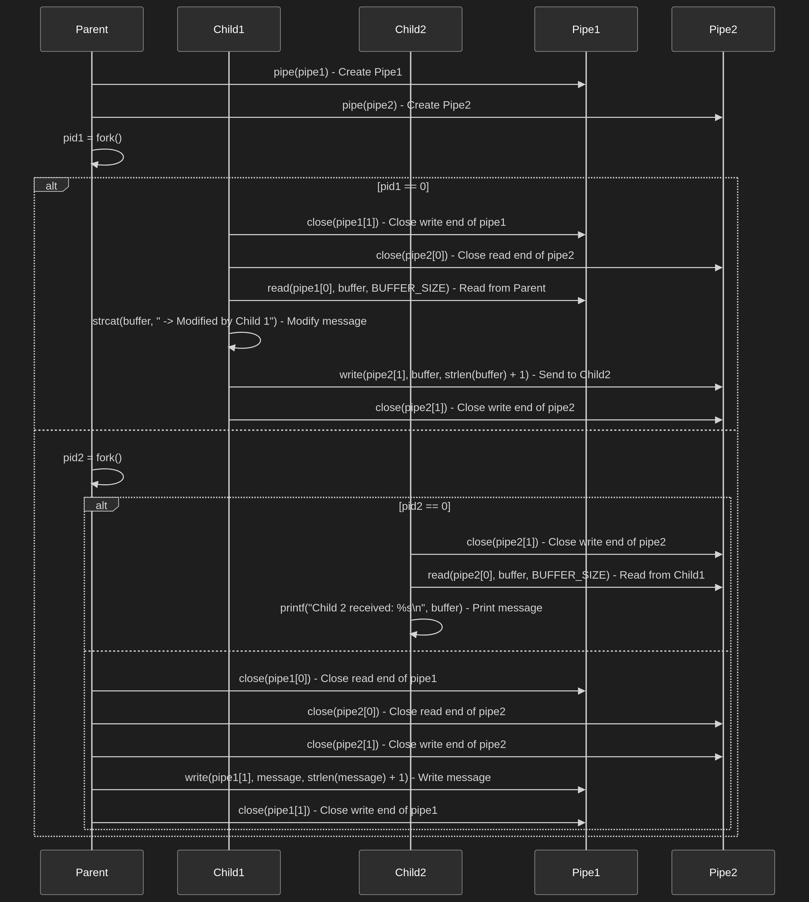

# Multi-Pipe Communication Between Parent and Multiple Child Processes

## Description
This project demonstrates inter-process communication (IPC) using multiple pipes in C.
The parent process sends a message to Child 1, which modifies it and forwards it to Child 2.

## Youtube Demo
[Click here ](https://youtu.be/nXhu17Qu0rk)

## Mermaid graph structure

