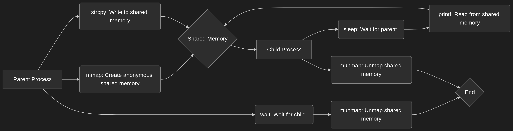

# POSIX Anonymous Shared Memory

This directory contains examples of using POSIX anonymous shared memory.

## Description

POSIX anonymous shared memory is a method of sharing memory between processes without using a file system object. The `shm_open` function is called with `SHM_ANON` flag to create an anonymous shared memory object.

## Files

*   `anon_shared.c`: This file contains the code for creating and accessing the shared memory.
*   `POSIX_anonymous_share_memory.png`: This file contains a diagram illustrating the concept of POSIX anonymous shared memory.
*   `workflow.mmd`: This file contains a mermaid diagram illustrating the workflow of POSIX anonymous shared memory.
*   `build.sh`: This script compiles the `anon_shared.c` file.

## Build and Run

To build and run the example, execute the following commands:

```bash
chmod +x build.sh
./build.sh
./anon_shared
```

## Youtube Demo
[Click here ](https://youtu.be/E4ytbaqNfiE)


## Mermaid graph structure
