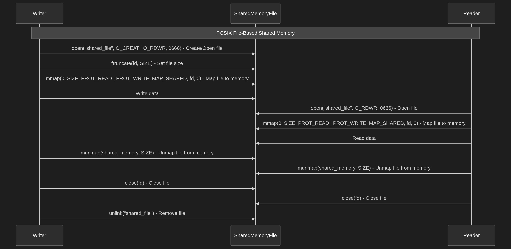

# POSIX File Shared Memory

This directory contains examples of using POSIX file shared memory.

## Description

POSIX file shared memory is a method of sharing memory between processes using a file system object. The `shm_open` function is called to create or open a shared memory object, which is then mapped into the address space of the processes using `mmap`.

## Files

*   `posix_reader.c`: This file contains the code for the reader process.
*   `posix_writer.c`: This file contains the code for the writer process.
*   `POSIX_file_share_memory.png`: This file contains a diagram illustrating the concept of POSIX file shared memory.
*   `workflow.mmd`: This file contains a mermaid diagram illustrating the workflow of POSIX file shared memory.
*   `build.sh`: This script compiles the `posix_reader.c` and `posix_writer.c` files.

## Build and Run

To build and run the example, execute the following commands:

```bash
chmod +x build.sh
./build.sh
./posix_writer
./posix_reader
```

## Youtube Demo
[Click here ](https://youtu.be/E4ytbaqNfiE)


## Mermaid graph structure
