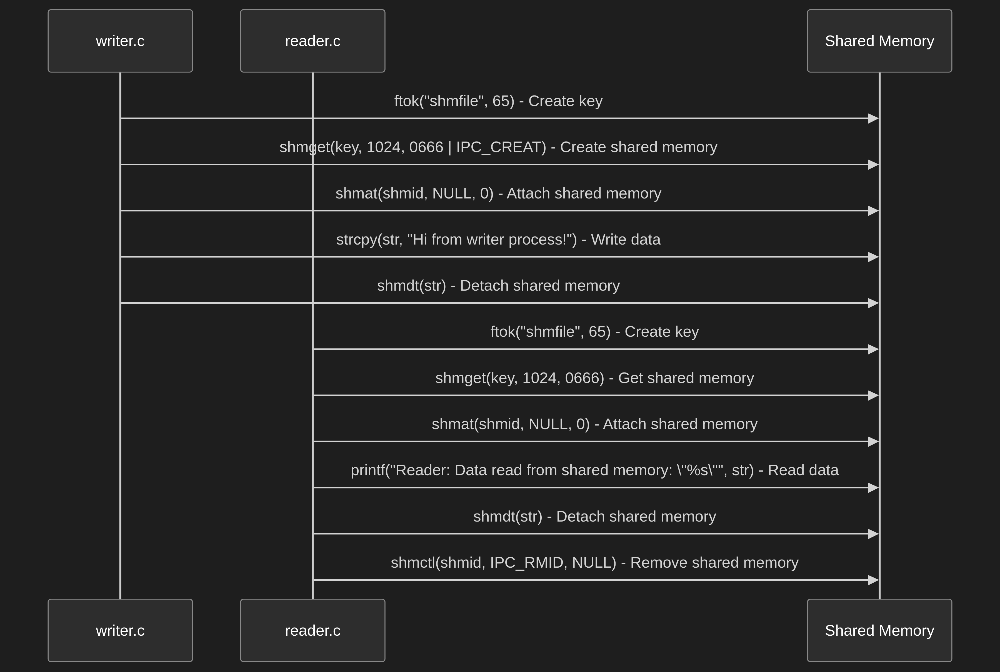

# System V Shared Memory

This directory contains examples of using System V shared memory.

## Description

System V shared memory is a method of sharing memory between processes using a system-wide unique key. The `shmget` function is called to create or access a shared memory segment, which is then attached to the address space of the processes using `shmat`.

## Files

*   `reader.c`: This file contains the code for the reader process.
*   `writer.c`: This file contains the code for the writer process.
*   `system_V_share.png`: This file contains a diagram illustrating the concept of System V shared memory.
*   `workflow.mmd`: This file contains a mermaid diagram illustrating the workflow of System V shared memory.
*   `Makefile`: This file contains the instructions for compiling the `reader.c` and `writer.c` files.

## Build and Run

To build and run the example, execute the following commands:

```bash
make
./writer
./reader
```

## Youtube Demo
[Click here ](https://youtu.be/E4ytbaqNfiE)


## Mermaid graph structure
