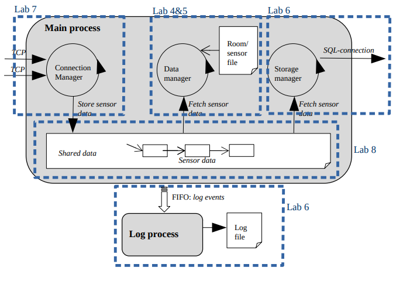

# Sensor Gateway System

[](https://youtu.be/vaJ8g9HPFM4)

*Click the image above to watch the demo video on YouTube*

This project implements a sensor gateway system that collects data from sensor nodes, processes it, and stores it in an SQLite database. The system consists of a main process with three threads and a separate log process.

## Architecture



### Interactive Visualization

An interactive, animated visualization of the system is available. To view the animation:

1. Open the `animate_temperature.html` file in a web browser
2. Click the "Start Animation" button to begin
3. Watch as data flows through the system components
4. Use the controls to pause or reset the animation

The animation demonstrates how data moves from sensor nodes through the various components of the system, including:
- Data collection by the Connection Manager
- Running average calculation in the Data Manager
- Threshold detection for temperature events
- Storage of data in the SQLite database
- Logging of events through the FIFO to the Log Process

This visualization helps to understand the dynamic behavior of the system in real-time.

The system consists of the following components:

1. **Main Process**: Contains three threads:
   - Connection Manager Thread
   - Data Manager Thread
   - Storage Manager Thread

2. **Log Process**: Handles logging of events from the main process

3. **Shared Data Structure**: Thread-safe data structure for communication between threads

4. **FIFO**: Named pipe for communication between the main process and log process

## Features

- TCP socket communication with sensor nodes
- Thread-safe shared data structure
- Running average calculation for temperature data
- SQLite database storage
- Logging system with sequence numbers and timestamps
- Interactive animated visualization of data flow
- Graceful error handling and shutdown
- Multiple server instances support with port-specific resources
- I/O multiplexing for handling multiple concurrent connections
- Connection statistics with detailed information about active connections
- Sensor simulator for testing and demonstration purposes
- Text-based protocol for sensor data transmission
- Authentication mechanism for sensor connections
- Security features including IP blacklisting

## Requirements

- C compiler (gcc recommended)
- SQLite3 development libraries
- POSIX threads library
- POSIX real-time extensions library

## Building

To build the project, run:

```bash
make
```

This will create two executables:
- `server`: The main sensor gateway process
- `log_process`: The log process (started automatically by the server)

## Running

### Starting the Server

To run the sensor gateway, use:

```bash
./server [OPTIONS] [PORT]
```

Command-line options:
- `-p, --port PORT`: Port to listen on (default: 1234)
- `-h, --help`: Display help message

You can specify the port either with the `-p` option or as a positional argument:

```bash
# These commands are equivalent:
./server -p 1234
./server 1234
```

The server will listen for sensor connections on the specified port, process the data, store it in an SQLite database, and log events to a log file.

### Server Commands

Once the server is running, you can use the following commands:

- `status`: Display system status (uptime, connections, messages, CPU/memory usage)
- `stats`: Display detailed connection statistics
- `exit`: Shut down the server gracefully

### Running Multiple Instances

You can run multiple server instances on different ports. Each instance will use its own resources (FIFO, log file, etc.) based on the port number:

```bash
# Run two server instances
./server 1234 &
./server 1235 &
```

## Sensor Node Protocol

The system supports two protocols for sensor data transmission:

### Binary Protocol (Legacy)

Sensor nodes can send data packets in the following binary format:

```c
typedef struct {
    uint16_t node_id;
    uint16_t temperature;
    uint16_t humidity;
    uint16_t light;
} sensor_packet_t;
```

- `node_id`: Unique identifier for the sensor node (1-100)
- `temperature`: Temperature in 0.1°C units (e.g., 250 = 25.0°C)
- `humidity`: Humidity in 0.1% units (e.g., 500 = 50.0%)
- `light`: Light level (arbitrary units)

### Text-Based Protocol (Recommended)

The system also supports a text-based protocol that is more human-readable and easier to debug. The protocol consists of the following commands:

#### Authentication

```
AUTH <username> <password>
```

Example:
```
AUTH sensor_user password123
```

#### Sensor Data

```
DATA <node_id> <temperature> <humidity> <pressure> <timestamp>
```

Example:
```
DATA 1 25.5 50.2 1013.4 1682345678
```

Where:
- `node_id`: Unique identifier for the sensor node (1-100)
- `temperature`: Temperature in degrees Celsius
- `humidity`: Humidity percentage
- `pressure`: Atmospheric pressure in hPa
- `timestamp`: Unix timestamp (optional, server will use current time if omitted)

Notes:
- Authentication is required before sending data
- All connections are subject to security checks, including IP blacklisting for suspicious activity

## Log File Format

The log file (`gateway.log_<port>`) contains entries in the following format:

```
<sequence number> <timestamp> <log message>
```

For example:

```
1 2023-05-01 12:34:56 A sensor node with 1 has opened a new connection
2 2023-05-01 12:35:01 The sensor node with 1 reports it's too hot (running avg temperature = 32.5)
```

Each server instance creates its own log file with the port number appended to the filename. For example, a server running on port 1234 will create a log file named `gateway.log_1234`.

## Database Schema

The sensor data is stored in an SQLite database (`sensor_data.db`) with the following schema. Each server instance uses the same database file, but data is organized by sensor node ID:

```sql
CREATE TABLE sensor_data (
    id INTEGER PRIMARY KEY AUTOINCREMENT,
    node_id INTEGER NOT NULL,
    temperature REAL NOT NULL,
    humidity REAL NOT NULL,
    light REAL NOT NULL,
    timestamp INTEGER NOT NULL
);
```

## Cleaning Up

To clean up build artifacts and generated files, run:

```bash
make clean
```

## Connection Statistics

The system provides detailed statistics about active connections. You can view these statistics by entering the `stats` command while the server is running.

### Statistics Display

```
=== Connection Statistics ===
Total active connections: 1

Connection States:
  Active: 1

Authentication States:
  Success: 1

Connection Details:
Connection ID: 1
  IP: 127.0.0.1:60112
  State: Active
  Auth state: Success
  Username: sensor_user
  Connected for: 2 minutes, 30 seconds
  Idle for: 15 seconds
  Messages received: 10
  Messages sent: 5
  Bytes received: 1024
  Bytes sent: 512
  Errors: 0
===========================
```

The statistics display includes:
- Total number of active connections
- Summary of connection states (New, Authenticating, Active, etc.)
- Summary of authentication states (None, Pending, Success, Failed)
- Detailed information for each connection, including:
  - Connection ID and IP address
  - Connection state and authentication state
  - Username (if authenticated)
  - Connection duration and idle time
  - Message and byte counts
  - Error count

## Implementation Details

### Connection Manager Thread
- Listens on TCP socket for incoming connections
- Accepts connections from sensor nodes
- Reads sensor data packets
- Writes data to shared data structure
- Logs connection events
- Handles authentication and security checks

### Data Manager Thread
- Reads sensor data from shared data structure
- Calculates running average of temperature
- Determines if temperature is too hot/cold
- Logs temperature events

### Storage Manager Thread
- Reads sensor data from shared data structure
- Connects to SQLite database
- Inserts data into database
- Handles database connection failures
- Logs database events

### Log Process
- Opens FIFO for reading
- Reads log events from FIFO
- Writes log events to log file with sequence number and timestamp

## Security Features

The system includes several security features to protect against malicious activity:

### Authentication
- All sensor connections must authenticate before sending data
- Username and password verification
- Connection state tracking to prevent unauthenticated data transmission

### IP Blacklisting
- Automatic blacklisting of IPs that exhibit suspicious behavior
- Blacklist persistence across server restarts
- Protection against connection flooding and invalid data

### Connection Limits
- Maximum number of connections per IP address
- Maximum total connections to prevent resource exhaustion
- Connection timeout for inactive connections

### Error Tracking
- Tracking of errors per connection
- Automatic blacklisting after multiple errors
- Detailed logging of security events

## Sensor Simulator

The project includes a sensor simulator tool for testing and demonstration purposes. The simulator connects to the server, authenticates, and sends realistic sensor data at regular intervals.

### Running the Sensor Simulator

```bash
./sensor_simulator [OPTIONS]
```

Command-line options:
- `-i, --id ID`: Sensor ID (default: 1)
- `-s, --server IP`: Server IP address (default: 127.0.0.1)
- `-p, --port PORT`: Server port (default: 1245)
- `-t, --interval SEC`: Data transmission interval in seconds (default: 30)
- `-u, --username USER`: Username for authentication (default: sensor_user)
- `-w, --password PASS`: Password for authentication (default: password123)
- `-h, --help`: Display help message

Example:
```bash
./sensor_simulator --id 2 --server 192.168.1.100 --port 1234 --interval 15
```

### Running Multiple Simulators

The project also includes a script to run multiple sensor simulators simultaneously:

```bash
./run_sensors.sh [OPTIONS]
```

Command-line options:
- `-s, --server IP`: Server IP address (default: 127.0.0.1)
- `-p, --port PORT`: Server port (default: 1245)
- `-n, --num COUNT`: Number of sensors to simulate (default: 3)
- `-t, --interval SEC`: Data transmission interval in seconds (default: 30)
- `-h, --help`: Display help message

Example:
```bash
./run_sensors.sh --num 5 --interval 20
```

## Visualizations

### System Flow Animation

The project includes an interactive HTML-based animation (`animate_temperature.html`) that visualizes the data flow through the sensor gateway system. This animation helps to understand the dynamic behavior of the system and how the different components interact.

### Real-Time Sensor History Visualization

The project also includes a real-time visualization of sensor data history (`sensor_history.html`). This visualization shows how sensor values (temperature, humidity, pressure) change over time and provides the following features:

- Real-time updates from sensor logs
- Interactive charts with zoom and pan capabilities
- Filtering by sensor node
- Playback animation of historical data
- Current value display for each sensor metric

#### Running the Visualization

To start the visualization system, use the provided script:

```bash
./start_visualization.sh
```

This script will:
1. Start the sensor gateway server
2. Launch multiple sensor simulators
3. Start the log parser to extract data from logs
4. Start a simple HTTP server
5. Make the visualization available at http://localhost:8000/sensor_history.html

You can also run the components individually:

```bash
# Parse logs and generate JSON data
python3 parse_logs.py

# Monitor logs for changes and update JSON data
python3 parse_logs.py --monitor --interval 5

# Start a simple HTTP server
python3 -m http.server 8000
```

Then open `sensor_history.html` in your web browser.

### Animation Features

- **Data Flow Visualization**: Orange dots represent data packets flowing through the system
- **Component Highlighting**: Components are highlighted as data passes through them
- **Interactive Controls**: Start, stop, and reset the animation
- **Continuous Loop**: The animation cycles continuously to show ongoing data processing

### Technical Implementation

The animation is implemented using HTML, CSS, and JavaScript. It overlays animated elements on top of the static architecture diagram to show the movement of data through the system. The animation uses the following techniques:

- Absolute positioning of elements over the base image
- CSS animations for visual effects
- JavaScript for controlling the animation flow
- Dynamic path calculation for data movement

### Using the Animation for Presentations

The animated visualization is particularly useful for presentations and demonstrations of the sensor gateway system. It provides a clear, visual explanation of how data flows through the system and how the different components interact with each other.

## License

This project is licensed under the MIT License - see the LICENSE file for details.
