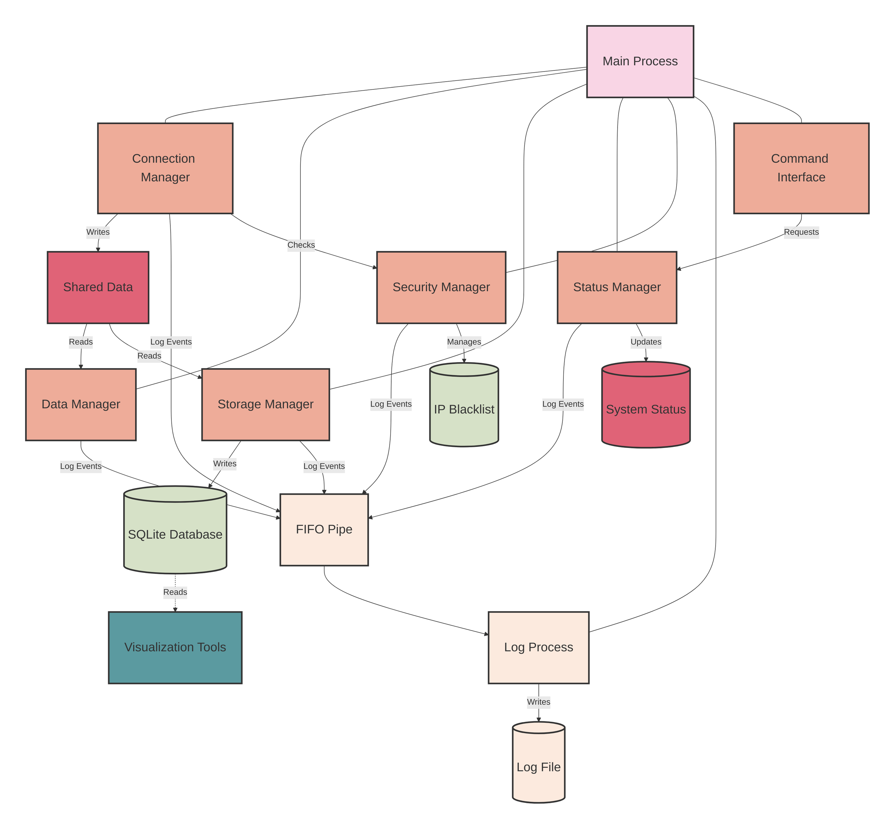

```mermaid
%%{init: {'theme': 'default', 'flowchart': {'htmlLabels': true, 'curve': 'basis', 'diagramPadding': 50, 'useMaxWidth': false, 'width': 1200, 'height': 800}, 'fontSize': 20} }%%
flowchart TD
    %% Main components with larger, more visible nodes
    Main[Main Process] --- CM[Connection Manager]
    Main --- DM[Data Manager]
    Main --- SM[Storage Manager]
    Main --- Status[Status Manager]
    Main --- Security[Security Manager]
    Main --- LogP[Log Process]
    Main --- CMD[Command Interface]
    
    %% Data flow
    CM -->|Writes| SharedData[Shared Data]
    SharedData -->|Reads| DM
    SharedData -->|Reads| SM
    
    %% Database interaction
    SM -->|Writes| DB[(SQLite Database)]
    
    %% Logging
    CM & DM & SM & Status & Security -->|Log Events| FIFO[FIFO Pipe]
    FIFO --> LogP
    LogP -->|Writes| LogFile[(Log File)]
    
    %% Security interactions
    CM -->|Checks| Security
    Security -->|Manages| Blacklist[(IP Blacklist)]
    
    %% Status reporting
    Status -->|Updates| SysStatus[(System Status)]
    CMD -->|Requests| Status
    
    %% Visualization
    DB -.->|Reads| Viz[Visualization Tools]
    
    %% Style definitions with larger, more visible nodes
    classDef main fill:#f9d5e5,stroke:#333,stroke-width:3px,font-size:24px,padding:20px;
    classDef manager fill:#eeac99,stroke:#333,stroke-width:3px,font-size:24px,padding:20px;
    classDef data fill:#e06377,stroke:#333,stroke-width:3px,font-size:24px,padding:20px;
    classDef log fill:#fceade,stroke:#333,stroke-width:3px,font-size:24px,padding:20px;
    classDef storage fill:#d6e1c7,stroke:#333,stroke-width:3px,font-size:24px,padding:20px;
    classDef viz fill:#5b9aa0,stroke:#333,stroke-width:3px,font-size:24px,padding:20px;
    
    %% Apply styles
    class Main main;
    class CM,DM,SM,Status,Security,CMD manager;
    class SharedData,SysStatus data;
    class LogP,FIFO,LogFile log;
    class DB,Blacklist storage;
    class Viz viz;
```
