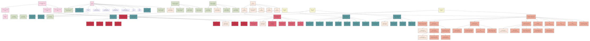

```mermaid
%%{init: {'theme': 'default', 'flowchart': {'htmlLabels': true, 'curve': 'basis', 'diagramPadding': 50, 'useMaxWidth': false, 'width': 1800, 'height': 1400, 'rankSpacing': 80, 'nodeSpacing': 80}, 'fontSize': 16} }%%
flowchart TD
    %% Main Process Functions
    main[main\nmain.c] --> init_security[init_security_manager\nsecurity_manager.c]
    main --> init_status[init_status_manager\nstatus_manager.c]
    main --> create_fifo[mkfifo\nmain.c]
    main --> fork_log[fork\nmain.c]
    main --> create_conn_thread[pthread_create\nconnection_manager_thread]
    main --> create_data_thread[pthread_create\ndata_manager_thread]
    main --> create_storage_thread[pthread_create\nstatus_manager_thread]
    main --> create_cmd_thread[pthread_create\ncommand_input_thread]
    main --> join_threads[pthread_join\nmain.c]
    main --> cleanup_status[cleanup_status_manager\nstatus_manager.c]
    main --> cleanup_security[cleanup_security_manager\nsecurity_manager.c]

    %% Command Input Thread
    cmd_thread[command_input_thread\nmain.c] --> handle_status[handle_status_command\nmain.c]
    cmd_thread --> handle_stats[handle_stats_command\nmain.c]
    cmd_thread --> handle_exit[handle_exit_command\nmain.c]

    handle_status --> print_status[print_system_status\nstatus_manager.c]
    handle_stats --> print_conn_stats[print_connection_stats\nstatus_manager.c]
    handle_exit --> set_running_false[running = 0\nmain.c]

    %% Connection Manager Thread
    conn_thread[connection_manager_thread\nconnection_manager_epoll.c] --> init_conn_mgr[init_connection_manager\nconnection_manager_epoll.c]
    conn_thread --> create_socket[socket\nconnection_manager_epoll.c]
    conn_thread --> bind_socket[bind\nconnection_manager_epoll.c]
    conn_thread --> listen_socket[listen\nconnection_manager_epoll.c]
    conn_thread --> epoll_wait[epoll_wait\nconnection_manager_epoll.c]
    conn_thread --> handle_new_conn[handle_new_connection\nconnection_manager_epoll.c]
    conn_thread --> handle_client[handle_client_data\nconnection_manager_epoll.c]
    conn_thread --> check_timeouts[check_timeouts\nconnection_manager_epoll.c]
    conn_thread --> cleanup_conn_mgr[cleanup_connection_manager\nconnection_manager_epoll.c]

    handle_new_conn --> check_limit[check_connection_limit\nconnection_manager_epoll.c]
    handle_new_conn --> check_blacklist[is_ip_blacklisted_local\nconnection_manager_epoll.c]
    handle_new_conn --> create_session[create_connection_session\nconnection_manager_epoll.c]
    handle_new_conn --> add_conn[add_connection\nconnection_manager_epoll.c]
    handle_new_conn --> write_log1[write_log_event\nconnection_manager_epoll.c]

    handle_client --> update_activity[update_connection_activity\nconnection_manager_epoll.c]
    handle_client --> recv_data[recv\nconnection_manager_epoll.c]
    handle_client --> set_auth[set_connection_authenticated\nconnection_manager_epoll.c]
    handle_client --> update_shared_data[shared_data update\nconnection_manager_epoll.c]

    check_timeouts --> find_conn[find_connection_by_socket\nconnection_manager_epoll.c]
    check_timeouts --> close_conn[close_connection\nconnection_manager_epoll.c]
    check_timeouts --> write_log2[write_log_event\nconnection_manager_epoll.c]

    close_conn --> remove_conn[remove_connection\nconnection_manager_epoll.c]
    close_conn --> free_session[free_connection_session\nconnection_manager_epoll.c]
    close_conn --> write_log3[write_log_event\nconnection_manager_epoll.c]

    %% Data Manager Thread
    data_thread[data_manager_thread\ndata_manager.c] --> alloc_avg[malloc\ndata_manager.c]
    data_thread --> lock_shared1[pthread_mutex_lock\ndata_manager.c]
    data_thread --> process_data[process sensor data\ndata_manager.c]
    data_thread --> check_temp[check temperature thresholds\ndata_manager.c]
    data_thread --> write_log4[write_log_event\ndata_manager.c]
    data_thread --> unlock_shared1[pthread_mutex_unlock\ndata_manager.c]

    %% Storage Manager Thread
    storage_thread[storage_manager_thread\nstorage_manager.c] --> connect_db[sqlite3_open\nstorage_manager.c]
    storage_thread --> create_table[sqlite3_exec\nstorage_manager.c]
    storage_thread --> write_log5[write_log_event\nstorage_manager.c]
    storage_thread --> lock_shared2[pthread_mutex_lock\nstorage_manager.c]
    storage_thread --> prepare_stmt[sqlite3_prepare_v2\nstorage_manager.c]
    storage_thread --> bind_values[sqlite3_bind_*\nstorage_manager.c]
    storage_thread --> exec_stmt[sqlite3_step\nstorage_manager.c]
    storage_thread --> unlock_shared2[pthread_mutex_unlock\nstorage_manager.c]

    %% Status Manager Thread
    status_thread[status_manager_thread\nstatus_manager.c] --> lock_status[pthread_mutex_lock\nstatus_manager.c]
    status_thread --> get_cpu[get_cpu_usage\nstatus_manager.c]
    status_thread --> get_mem[get_memory_usage\nstatus_manager.c]
    status_thread --> write_log6[write_log_event\nstatus_manager.c]
    status_thread --> unlock_status[pthread_mutex_unlock\nstatus_manager.c]

    init_status --> init_sys_status[init_system_status\nstatus_manager.c]
    init_status --> create_status_thread[pthread_create\nstatus_manager.c]

    update_sys_status[update_system_status\nstatus_manager.c] --> lock_status2[pthread_mutex_lock\nstatus_manager.c]
    update_sys_status --> lock_conn[pthread_mutex_lock\nstatus_manager.c]
    update_sys_status --> calc_stats[calculate statistics\nstatus_manager.c]
    update_sys_status --> get_cpu2[get_cpu_usage\nstatus_manager.c]
    update_sys_status --> get_mem2[get_memory_usage\nstatus_manager.c]
    update_sys_status --> unlock_conn[pthread_mutex_unlock\nstatus_manager.c]
    update_sys_status --> unlock_status2[pthread_mutex_unlock\nstatus_manager.c]

    %% Security Manager Functions
    init_security --> load_bl[load_blacklist\nsecurity_manager.c]

    cleanup_security --> save_bl[save_blacklist\nsecurity_manager.c]
    cleanup_security --> free_bl[free blacklist\nsecurity_manager.c]

    auth_conn[authenticate_connection\nsecurity_manager.c] --> lock_session[pthread_mutex_lock\nsecurity_manager.c]
    auth_conn --> update_auth_state[update auth state\nsecurity_manager.c]
    auth_conn --> unlock_session[pthread_mutex_unlock\nsecurity_manager.c]
    auth_conn --> write_log7[write_log_event\nsecurity_manager.c]

    add_blacklist[add_ip_to_blacklist\nsecurity_manager.c] --> check_bl[is_ip_blacklisted\nsecurity_manager.c]
    add_blacklist --> add_to_bl[add_to_blacklist\nsecurity_manager.c]
    add_blacklist --> write_log8[write_log_event\nsecurity_manager.c]
    add_blacklist --> save_bl2[save_blacklist\nsecurity_manager.c]

    %% Log Process
    log_process[main\nlog_process.c] --> open_fifo[open\nlog_process.c]
    log_process --> open_log[fopen\nlog_process.c]
    log_process --> read_log[read\nlog_process.c]
    log_process --> process_log[process_log_events\nlog_process.c]
    log_process --> write_log_file[fprintf\nlog_process.c]

    %% Shared Data Structure
    shared_data[shared_data\nshared.h] --- conn_thread
    shared_data --- data_thread
    shared_data --- storage_thread

    %% System Status Structure
    system_status[system_status\nshared.h] --- status_thread
    system_status --- print_status
    system_status --- update_sys_status

    %% Connection List Structure
    conn_list[connection_list\nshared.h] --- conn_thread
    conn_list --- print_conn_stats
    conn_list --- update_sys_status

    %% Style definitions
    classDef main fill:#f9d5e5,stroke:#333,stroke-width:2px,font-size:18px,padding:15px;
    classDef conn fill:#eeac99,stroke:#333,stroke-width:2px,font-size:18px,padding:15px;
    classDef data fill:#e06377,stroke:#333,stroke-width:2px,font-size:18px,padding:15px;
    classDef storage fill:#c83349,stroke:#333,stroke-width:2px,font-size:18px,padding:15px;
    classDef status fill:#5b9aa0,stroke:#333,stroke-width:2px,font-size:18px,padding:15px;
    classDef security fill:#d6e1c7,stroke:#333,stroke-width:2px,font-size:18px,padding:15px;
    classDef log fill:#fceade,stroke:#333,stroke-width:2px,font-size:18px,padding:15px;
    classDef shared fill:#f7f6cf,stroke:#333,stroke-width:2px,font-size:18px,padding:15px;

    %% Apply styles
    class main,cmd_thread,handle_status,handle_stats,handle_exit,set_running_false main;
    class conn_thread,init_conn_mgr,create_socket,bind_socket,listen_socket,epoll_wait,handle_new_conn,handle_client,check_timeouts,cleanup_conn_mgr,check_limit,check_blacklist,create_session,add_conn,update_activity,recv_data,set_auth,update_shared_data,find_conn,close_conn,remove_conn,free_session conn;
    class data_thread,alloc_avg,lock_shared1,process_data,check_temp,unlock_shared1 data;
    class storage_thread,connect_db,create_table,lock_shared2,prepare_stmt,bind_values,exec_stmt,unlock_shared2 storage;
    class status_thread,init_status,cleanup_status,lock_status,get_cpu,get_mem,unlock_status,init_sys_status,create_status_thread,update_sys_status,lock_status2,lock_conn,calc_stats,get_cpu2,get_mem2,unlock_conn,unlock_status2,print_status,print_conn_stats status;
    class init_security,cleanup_security,load_bl,save_bl,free_bl,auth_conn,lock_session,update_auth_state,unlock_session,add_blacklist,check_bl,add_to_bl,save_bl2 security;
    class log_process,open_fifo,open_log,read_log,process_log,write_log_file log;
    class shared_data,system_status,conn_list shared;
    class write_log1,write_log2,write_log3,write_log4,write_log5,write_log6,write_log7,write_log8 log;
```
