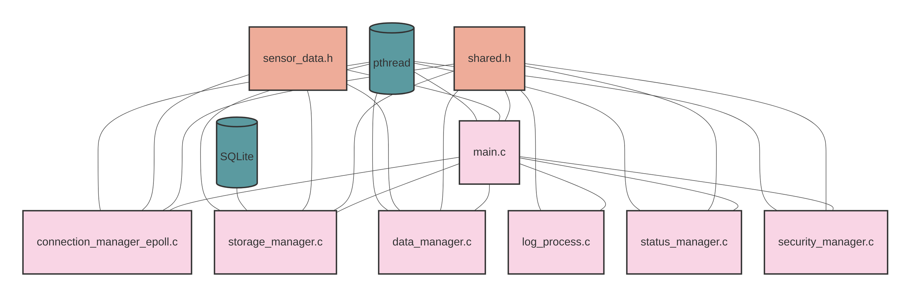

```mermaid
%%{init: {'theme': 'default', 'flowchart': {'htmlLabels': true, 'curve': 'basis', 'diagramPadding': 50, 'useMaxWidth': false, 'width': 1200, 'height': 800}, 'fontSize': 20} }%%
flowchart TD
    %% Source files as nodes
    Main[main.c] --- ConnMgr[connection_manager_epoll.c]
    Main --- DataMgr[data_manager.c]
    Main --- StorageMgr[storage_manager.c]
    Main --- StatusMgr[status_manager.c]
    Main --- SecurityMgr[security_manager.c]
    Main --- LogProc[log_process.c]
    
    %% Header files
    Shared[shared.h] --- Main
    Shared --- ConnMgr
    Shared --- DataMgr
    Shared --- StorageMgr
    Shared --- StatusMgr
    Shared --- SecurityMgr
    Shared --- LogProc
    
    SensorData[sensor_data.h] --- Main
    SensorData --- ConnMgr
    SensorData --- DataMgr
    SensorData --- StorageMgr
    
    %% External dependencies
    SQLite[(SQLite)] --- StorageMgr
    Pthread[(pthread)] --- Main
    Pthread --- ConnMgr
    Pthread --- DataMgr
    Pthread --- StorageMgr
    Pthread --- StatusMgr
    Pthread --- SecurityMgr
    
    %% Style definitions
    classDef source fill:#f9d5e5,stroke:#333,stroke-width:3px,font-size:24px,padding:20px;
    classDef header fill:#eeac99,stroke:#333,stroke-width:3px,font-size:24px,padding:20px;
    classDef external fill:#5b9aa0,stroke:#333,stroke-width:3px,font-size:24px,padding:20px;
    
    %% Apply styles
    class Main,ConnMgr,DataMgr,StorageMgr,StatusMgr,SecurityMgr,LogProc source;
    class Shared,SensorData header;
    class SQLite,Pthread external;
```
