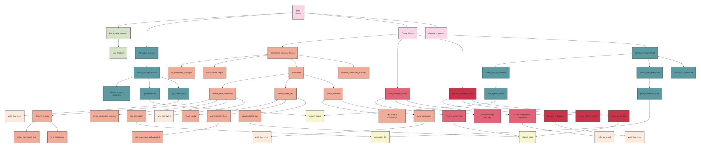

```mermaid
%%{init: {'theme': 'default', 'flowchart': {'htmlLabels': true, 'curve': 'basis', 'diagramPadding': 50, 'useMaxWidth': false, 'width': 1800, 'height': 1400, 'rankSpacing': 80, 'nodeSpacing': 80}, 'fontSize': 16} }%%
flowchart TD
    %% Main components
    main[main\nmain.c] --> init_security[init_security_manager]
    main --> init_status[init_status_manager]
    main --> create_threads[Create threads]
    main --> cleanup[Cleanup resources]

    %% Thread creation
    create_threads --> conn_thread[connection_manager_thread]
    create_threads --> data_thread[data_manager_thread]
    create_threads --> storage_thread[storage_manager_thread]
    create_threads --> cmd_thread[command_input_thread]

    %% Command thread functions
    cmd_thread --> handle_status[handle_status_command]
    cmd_thread --> handle_stats[handle_stats_command]
    cmd_thread --> handle_exit[handle_exit_command]

    handle_status --> print_status[print_system_status]
    handle_stats --> print_conn_stats[print_connection_stats]

    %% Connection manager functions
    conn_thread --> init_conn[init_connection_manager]
    conn_thread --> setup_socket[Setup socket & epoll]
    conn_thread --> event_loop[Event loop]
    conn_thread --> cleanup_conn[cleanup_connection_manager]

    event_loop --> handle_new_conn[handle_new_connection]
    event_loop --> handle_client[handle_client_data]
    event_loop --> check_timeouts[check_timeouts]

    handle_new_conn --> security_checks[Security checks]
    handle_new_conn --> create_session[create_connection_session]
    handle_new_conn --> add_conn[add_connection]

    security_checks --> check_limit[check_connection_limit]
    security_checks --> check_blacklist[is_ip_blacklisted]

    handle_client --> recv_data[Receive data]
    handle_client --> auth_check[Authentication check]
    handle_client --> update_shared[Update shared data]

    auth_check --> set_auth[set_connection_authenticated]

    check_timeouts --> find_inactive[Find inactive connections]
    check_timeouts --> close_conn[close_connection]

    %% Data manager functions
    data_thread --> process_data[Process sensor data]
    data_thread --> calc_avg[Calculate running average]
    data_thread --> check_thresholds[Check temperature thresholds]

    %% Storage manager functions
    storage_thread --> connect_db[Connect to database]
    storage_thread --> create_table[Create table if needed]
    storage_thread --> store_data[Store sensor data]

    %% Status manager functions
    init_status --> create_status_thread[status_manager_thread]

    create_status_thread --> monitor_system[Monitor system resources]
    create_status_thread --> update_stats[Update statistics]
    create_status_thread --> log_status[Log system status]

    %% Security manager functions
    init_security --> load_blacklist[load_blacklist]

    %% Shared data access
    update_shared --> shared_data[shared_data]
    process_data --> shared_data
    store_data --> shared_data

    %% System status access
    update_stats --> system_status[system_status]
    print_status --> system_status

    %% Connection list access
    add_conn --> conn_list[connection_list]
    print_conn_stats --> conn_list

    %% Logging
    handle_new_conn --> write_log1[write_log_event]
    close_conn --> write_log2[write_log_event]
    check_thresholds --> write_log3[write_log_event]
    connect_db --> write_log4[write_log_event]
    log_status --> write_log5[write_log_event]

    %% Style definitions
    classDef main fill:#f9d5e5,stroke:#333,stroke-width:2px,font-size:18px,padding:15px;
    classDef conn fill:#eeac99,stroke:#333,stroke-width:2px,font-size:18px,padding:15px;
    classDef data fill:#e06377,stroke:#333,stroke-width:2px,font-size:18px,padding:15px;
    classDef storage fill:#c83349,stroke:#333,stroke-width:2px,font-size:18px,padding:15px;
    classDef status fill:#5b9aa0,stroke:#333,stroke-width:2px,font-size:18px,padding:15px;
    classDef security fill:#d6e1c7,stroke:#333,stroke-width:2px,font-size:18px,padding:15px;
    classDef log fill:#fceade,stroke:#333,stroke-width:2px,font-size:18px,padding:15px;
    classDef shared fill:#f7f6cf,stroke:#333,stroke-width:2px,font-size:18px,padding:15px;

    %% Apply styles
    class main,create_threads,cleanup main;
    class conn_thread,init_conn,setup_socket,event_loop,cleanup_conn,handle_new_conn,handle_client,check_timeouts,security_checks,create_session,add_conn,check_limit,check_blacklist,recv_data,auth_check,set_auth,update_shared,find_inactive,close_conn conn;
    class data_thread,process_data,calc_avg,check_thresholds data;
    class storage_thread,connect_db,create_table,store_data storage;
    class init_status,create_status_thread,monitor_system,update_stats,log_status,print_status,print_conn_stats,handle_status,handle_stats,cmd_thread,handle_exit status;
    class init_security,load_blacklist security;
    class write_log1,write_log2,write_log3,write_log4,write_log5 log;
    class shared_data,system_status,conn_list shared;
```
