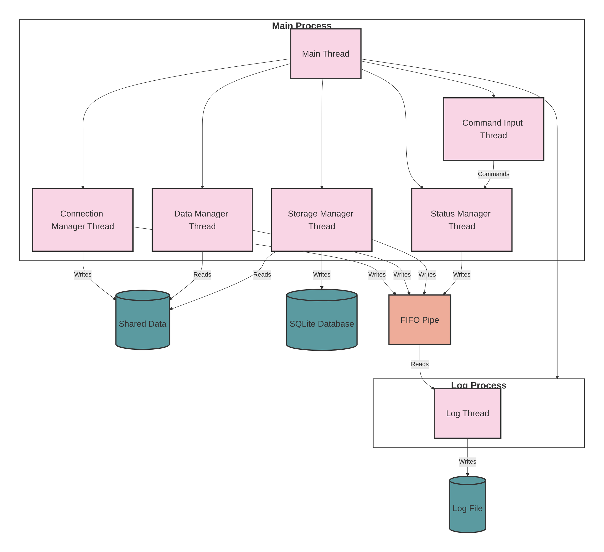

```mermaid
%%{init: {'theme': 'default', 'flowchart': {'htmlLabels': true, 'curve': 'basis', 'diagramPadding': 50, 'useMaxWidth': false, 'width': 1200, 'height': 800}, 'fontSize': 20} }%%
flowchart TD
    %% Processes and Threads
    subgraph MainProcess["Main Process"]
        Main["Main Thread"]
        ConnThread["Connection Manager Thread"]
        DataThread["Data Manager Thread"]
        StorageThread["Storage Manager Thread"]
        StatusThread["Status Manager Thread"]
        CmdThread["Command Input Thread"]
    end
    
    subgraph LogProcess["Log Process"]
        LogThread["Log Thread"]
    end
    
    %% Thread creation
    Main --> ConnThread
    Main --> DataThread
    Main --> StorageThread
    Main --> StatusThread
    Main --> CmdThread
    Main --> LogProcess
    
    %% Shared data access
    SharedData[(Shared Data)]
    
    ConnThread -->|Writes| SharedData
    DataThread -->|Reads| SharedData
    StorageThread -->|Reads| SharedData
    
    %% Database access
    Database[(SQLite Database)]
    StorageThread -->|Writes| Database
    
    %% Logging
    FIFO[FIFO Pipe]
    ConnThread -->|Writes| FIFO
    DataThread -->|Writes| FIFO
    StorageThread -->|Writes| FIFO
    StatusThread -->|Writes| FIFO
    
    FIFO -->|Reads| LogThread
    LogFile[(Log File)]
    LogThread -->|Writes| LogFile
    
    %% Command handling
    CmdThread -->|Commands| StatusThread
    
    %% Style definitions
    classDef process fill:none,stroke:#333,stroke-width:2px,font-size:24px,font-weight:bold;
    classDef thread fill:#f9d5e5,stroke:#333,stroke-width:3px,font-size:22px,padding:15px;
    classDef data fill:#5b9aa0,stroke:#333,stroke-width:3px,font-size:22px,padding:15px;
    classDef pipe fill:#eeac99,stroke:#333,stroke-width:3px,font-size:22px,padding:15px;
    
    %% Apply styles
    class MainProcess,LogProcess process;
    class Main,ConnThread,DataThread,StorageThread,StatusThread,CmdThread,LogThread thread;
    class SharedData,Database,LogFile data;
    class FIFO pipe;
```
