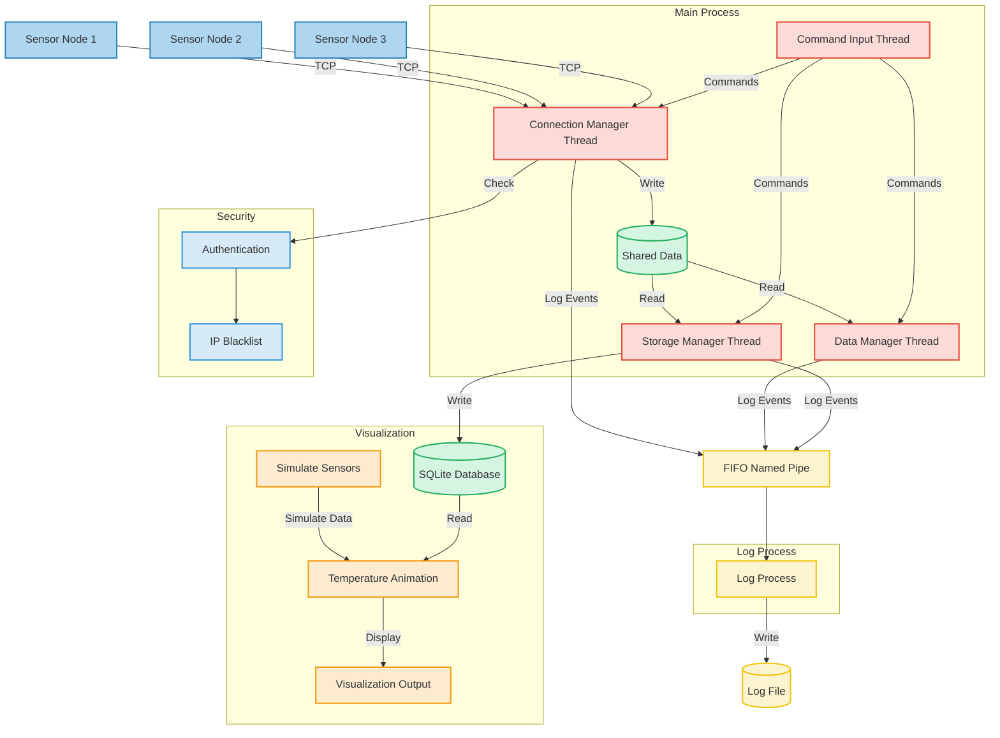

```mermaid
graph TD
    %% Define nodes
    SN1[Sensor Node 1] --> |TCP| CM
    SN2[Sensor Node 2] --> |TCP| CM
    SN3[Sensor Node 3] --> |TCP| CM
    
    subgraph "Main Process"
        CM[Connection Manager Thread]
        DM[Data Manager Thread]
        SM[Storage Manager Thread]
        CIT[Command Input Thread]
        SD[(Shared Data)]
        
        CM --> |Write| SD
        SD --> |Read| DM
        SD --> |Read| SM
        
        CIT --> |Commands| CM
        CIT --> |Commands| DM
        CIT --> |Commands| SM
    end
    
    CM --> |Log Events| FIFO
    DM --> |Log Events| FIFO
    SM --> |Log Events| FIFO
    
    FIFO[FIFO Named Pipe] --> LP
    
    subgraph "Log Process"
        LP[Log Process]
    end
    
    LP --> |Write| LF[(Log File)]
    
    SM --> |Write| DB[(SQLite Database)]
    
    subgraph "Visualization"
        TA[Temperature Animation]
        SS[Simulate Sensors]
        VO[Visualization Output]
        
        SS --> |Simulate Data| TA
        DB --> |Read| TA
        TA --> |Display| VO
    end
    
    subgraph "Security"
        AUTH[Authentication]
        IPB[IP Blacklist]
        
        AUTH --> IPB
    end
    
    CM --> |Check| AUTH
    
    %% Define styles
    classDef sensor fill:#AED6F1,stroke:#2E86C1,stroke-width:2px;
    classDef thread fill:#FADBD8,stroke:#E74C3C,stroke-width:2px;
    classDef data fill:#D5F5E3,stroke:#27AE60,stroke-width:2px;
    classDef log fill:#FCF3CF,stroke:#F1C40F,stroke-width:2px;
    classDef db fill:#E8DAEF,stroke:#8E44AD,stroke-width:2px;
    classDef viz fill:#FDEBD0,stroke:#F39C12,stroke-width:2px;
    classDef security fill:#D6EAF8,stroke:#3498DB,stroke-width:2px;
    
    %% Apply styles
    class SN1,SN2,SN3 sensor;
    class CM,DM,SM,CIT thread;
    class SD,DB data;
    class FIFO,LP,LF log;
    class TA,SS,VO viz;
    class AUTH,IPB security;
```
