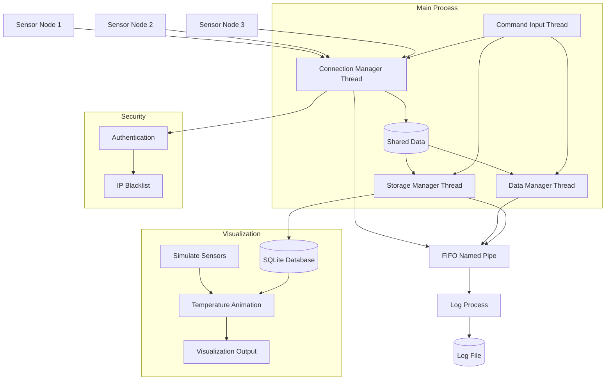

```mermaid
graph TD
    %% Sensor Nodes
    SN1[Sensor Node 1] --> CM
    SN2[Sensor Node 2] --> CM
    SN3[Sensor Node 3] --> CM
    
    %% Main Process
    subgraph MainProcess[Main Process]
        CM[Connection Manager Thread]
        DM[Data Manager Thread]
        SM[Storage Manager Thread]
        CIT[Command Input Thread]
        SD[(Shared Data)]
        
        CM --> SD
        SD --> DM
        SD --> SM
        CIT --> CM & DM & SM
    end
    
    %% Log Process
    CM & DM & SM --> FIFO[FIFO Named Pipe]
    FIFO --> LP[Log Process]
    LP --> LF[(Log File)]
    
    %% Database
    SM --> DB[(SQLite Database)]
    
    %% Visualization
    subgraph Visualization
        TA[Temperature Animation]
        SS[Simulate Sensors]
        VO[Visualization Output]
        
        SS --> TA
        DB --> TA
        TA --> VO
    end
    
    %% Security
    subgraph Security
        AUTH[Authentication]
        IPB[IP Blacklist]
        
        AUTH --> IPB
    end
    
    CM --> AUTH
```
