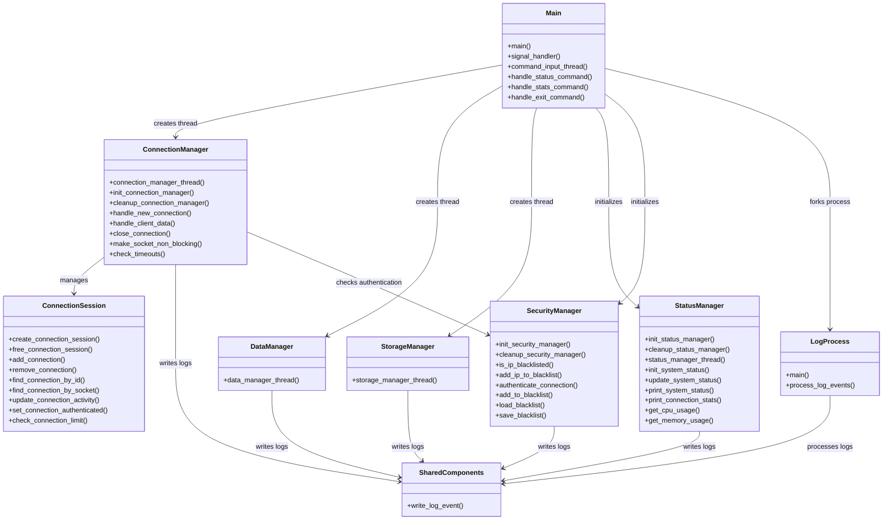

```mermaid
classDiagram
    %% Main components
    class Main {
        +main()
        +signal_handler()
        +command_input_thread()
        +handle_status_command()
        +handle_stats_command()
        +handle_exit_command()
    }

    %% Connection Manager
    class ConnectionManager {
        +connection_manager_thread()
        +init_connection_manager()
        +cleanup_connection_manager()
        +handle_new_connection()
        +handle_client_data()
        +close_connection()
        +make_socket_non_blocking()
        +check_timeouts()
    }

    %% Connection Session Management
    class ConnectionSession {
        +create_connection_session()
        +free_connection_session()
        +add_connection()
        +remove_connection()
        +find_connection_by_id()
        +find_connection_by_socket()
        +update_connection_activity()
        +set_connection_authenticated()
        +check_connection_limit()
    }

    %% Data Manager
    class DataManager {
        +data_manager_thread()
    }

    %% Storage Manager
    class StorageManager {
        +storage_manager_thread()
    }

    %% Status Manager
    class StatusManager {
        +init_status_manager()
        +cleanup_status_manager()
        +status_manager_thread()
        +init_system_status()
        +update_system_status()
        +print_system_status()
        +print_connection_stats()
        +get_cpu_usage()
        +get_memory_usage()
    }

    %% Security Manager
    class SecurityManager {
        +init_security_manager()
        +cleanup_security_manager()
        +is_ip_blacklisted()
        +add_ip_to_blacklist()
        +authenticate_connection()
        +add_to_blacklist()
        +load_blacklist()
        +save_blacklist()
    }

    %% Log Process
    class LogProcess {
        +main()
        +process_log_events()
    }

    %% Shared Components
    class SharedComponents {
        +write_log_event()
    }

    %% Relationships
    Main --> ConnectionManager : creates thread
    Main --> DataManager : creates thread
    Main --> StorageManager : creates thread
    Main --> StatusManager : initializes
    Main --> SecurityManager : initializes
    Main --> LogProcess : forks process

    ConnectionManager --> ConnectionSession : manages
    ConnectionManager --> SharedComponents : writes logs
    ConnectionManager --> SecurityManager : checks authentication

    DataManager --> SharedComponents : writes logs

    StorageManager --> SharedComponents : writes logs

    StatusManager --> SharedComponents : writes logs

    SecurityManager --> SharedComponents : writes logs

    LogProcess --> SharedComponents : processes logs
```
