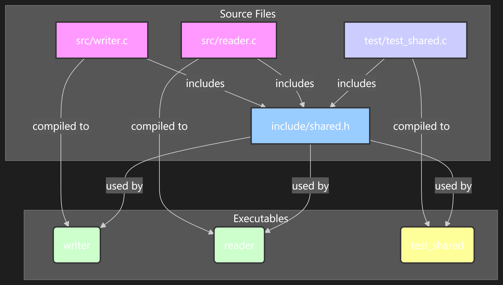
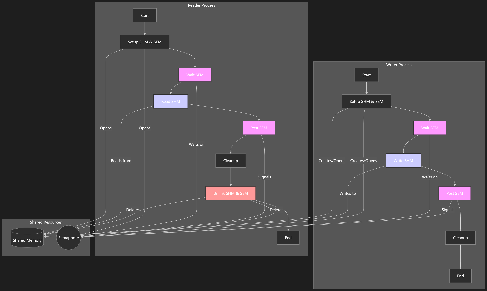

# POSIX Shared Memory and Semaphore Example

This project demonstrates inter-process communication (IPC) using POSIX shared memory and semaphores.

## Youtube Demo
[Click here ](hhttps://youtu.be/H-HjzywRRSw)

## General Graph structure

s
## Mermaid graph structure
