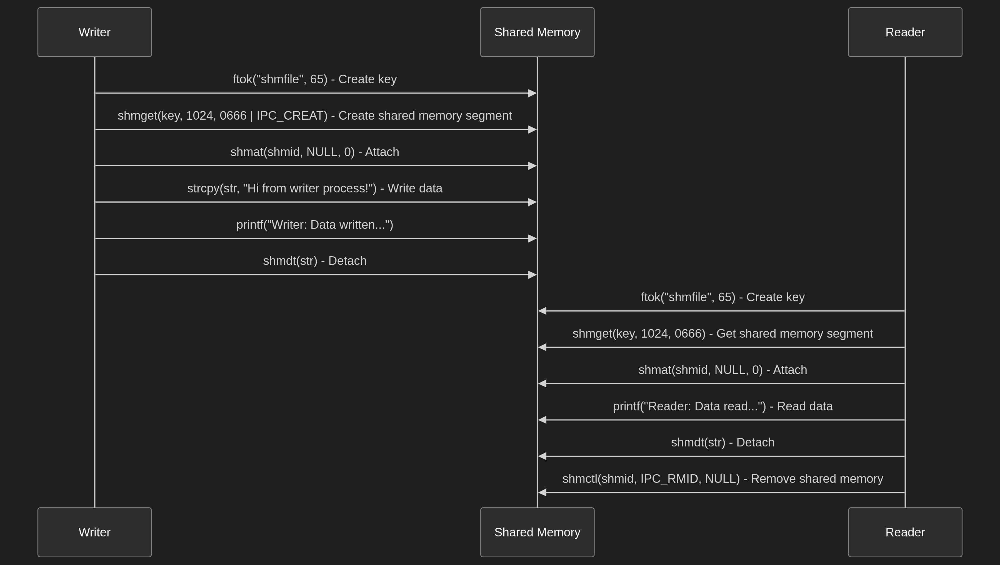

# Shared Memory Example

This example demonstrates inter-process communication using shared memory in Linux.

## Overview

The example consists of two programs:

*   **writer.c:** Creates a shared memory segment, writes a message to it, and then detaches from the segment.
*   **reader.c:** Attaches to the shared memory segment created by `writer.c`, reads the message from it, prints the message to the console, detaches from the segment, and removes the shared memory segment.

## Prerequisites

*   A Linux environment
*   GCC or another C compiler
*   Make (optional, but recommended)

## Building the Example

A `Makefile` is provided to simplify the build process. To build the example, run:

```bash
make
```

This will compile both `writer.c` and `reader.c` and create executable files named `writer` and `reader`.

## Running the Example

1.  First, run the `writer` program:

    ```bash
    ./writer
    ```

    This will create the shared memory segment and write a message to it.

2.  Next, run the `reader` program:

    ```bash
    ./reader
    ```

    This will attach to the shared memory segment, read the message, print it to the console, detach from the segment, and remove the shared memory segment.

## Code Explanation

### writer.c

1.  **Create a unique key:**

    ```c
    key_t key = ftok("shmfile", 65);
    ```

    The `ftok()` function generates a unique key based on a file path and a project ID. This key is used to identify the shared memory segment.

2.  **Create the shared memory segment:**

    ```c
    int shmid = shmget(key, 1024, 0666 | IPC_CREAT);
    ```

    The `shmget()` function creates a new shared memory segment. The arguments are:

    *   `key`: The unique key generated by `ftok()`.
    *   `1024`: The size of the shared memory segment in bytes.
    *   `0666 | IPC_CREAT`: The permissions for the shared memory segment. `0666` allows read and write access for all users. `IPC_CREAT` creates the segment if it does not already exist.

3.  **Attach to the shared memory segment:**

    ```c
    char *str = (char*) shmat(shmid, NULL, 0);
    ```

    The `shmat()` function attaches the shared memory segment to the process's address space. The arguments are:

    *   `shmid`: The ID of the shared memory segment.
    *   `NULL`: The address at which to attach the segment. `NULL` allows the system to choose the address.
    *   `0`: Flags. `0` means no flags are specified.

4.  **Write data to the shared memory segment:**

    ```c
    strcpy(str, "Hi from writer process!");
    ```

    The `strcpy()` function copies the string "Hi from writer process!" to the shared memory segment.

5.  **Detach from the shared memory segment:**

    ```c
    shmdt(str);
    ```

    The `shmdt()` function detaches the shared memory segment from the process's address space.

### reader.c

1.  **Create a unique key:**

    ```c
    key_t key = ftok("shmfile", 65);
    ```

    This is the same key used by `writer.c`.

2.  **Get the shared memory segment ID:**

    ```c
    int shmid = shmget(key, 1024, 0666);
    ```

    The `shmget()` function retrieves the ID of an existing shared memory segment. The arguments are the same as in `writer.c`, but the `IPC_CREAT` flag is not used because the segment is expected to already exist.

3.  **Attach to the shared memory segment:**

    ```c
    char *str = (char*) shmat(shmid, NULL, 0);
    ```

    This is the same as in `writer.c`.

4.  **Read data from the shared memory segment:**

    ```c
    printf("Data read from shared memory: %s\n", str);
    ```

    The `printf()` function reads the string from the shared memory segment and prints it to the console.

5.  **Detach from the shared memory segment:**

    ```c
    shmdt(str);
    ```

    This is the same as in `writer.c`.

6.  **Remove the shared memory segment:**

    ```c
    shmctl(shmid, IPC_RMID, NULL);
    ```

    The `shmctl()` function performs control operations on the shared memory segment. The arguments are:

    *   `shmid`: The ID of the shared memory segment.
    *   `IPC_RMID`: The command to remove the shared memory segment.
    *   `NULL`: A pointer to a `shmid_ds` structure. This is not needed for the `IPC_RMID` command, so `NULL` is passed.

## Makefile

The `Makefile` contains the following:

```makefile
all: writer reader

writer: writer.c
 gcc writer.c -o writer

reader: reader.c
 gcc reader.c -o reader

clean:
 rm -f writer reader
```

This `Makefile` defines rules to compile `writer.c` and `reader.c` into executable files named `writer` and `reader`, respectively. It also defines a `clean` rule to remove the executable files.


## 📺 Demo Video

[](https://youtu.be/LIACTVXpxSc)

Click the image above to watch the demo on YouTube.

## 🖼 Diagram

